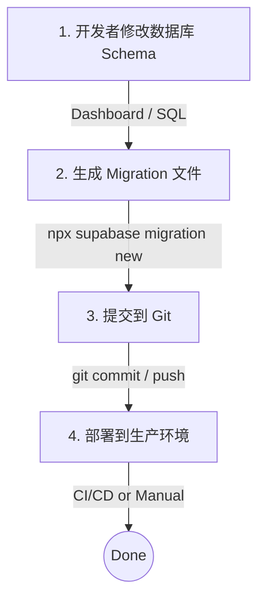

# TriTalk Database Migration Guide

TriTalk 使用 **Supabase Migration** 管理数据库 schema 变更。

## 🗄️ Database Migration

### Migration 文件位置

```
backend/supabase/migrations/
├── 20260101000001_initial_profiles.sql
├── 20260101000002_core_data_schema.sql
├── 20260101000003_add_bookmarks.sql
├── 20260101000004_add_scene_order.sql
├── 20260101000005_data_migration_v1.sql
├── 20260101000006_fix_triggers.sql
└── 20260101000007_ensure_updated_at.sql
```

### 常用命令

```bash
# 查看 migration 状态
npx supabase migration list

# 创建新的 migration
npx supabase migration new <migration_name>

# 应用 migration 到远程数据库
npx supabase db push

# 从远程数据库拉取当前 schema（生成 diff）
npx supabase db pull
```

### 新环境设置（如 Production）

对于**全新的数据库**（没有任何表），直接执行：

```bash
# 1. 链接到新项目
npx supabase link --project-ref YOUR_PROD_PROJECT_REF

# 2. 执行所有 migration
npx supabase db push
```

### 已有数据库设置（标记已执行的 Migration）

如果数据库中**已经手动执行过 SQL**，需要标记这些 migration 为"已应用"。

**方法 1：使用 CLI（推荐，但需要直接连接数据库）**

```bash
# 1. 链接到项目
npx supabase link --project-ref YOUR_PROJECT_REF

# 2. 标记所有现有 migration 为已执行（不实际执行 SQL）
npx supabase migration repair --status applied 20260101000001
npx supabase migration repair --status applied 20260101000002
npx supabase migration repair --status applied 20260101000003
npx supabase migration repair --status applied 20260101000004
npx supabase migration repair --status applied 20260101000005
npx supabase migration repair --status applied 20260101000006
npx supabase migration repair --status applied 20260101000007
```

**方法 2：在 Dashboard 中手动标记（CLI 连不上时使用）**

如果 CLI 连接报错（如 `setup-db` 失败），你可以直接在 Supabase Dashboard 的 SQL Editor 中运行我们准备好的修复脚本：

1. 打开 [Supabase SQL Editor](https://supabase.com/dashboard/project/_/sql)
2. 复制 `backend/supabase/repair_migrations.sql` 的内容并运行

### Migration 工作流程



### 自动化部署 (CI/CD)

项目配置了 GitHub Actions 自动管理数据库迁移：

#### 1. Dev 环境 (自动)

- **触发条件**: 代码合并或推送到 `main` 分支。
- **行为**: 自动将新的 Migration 应用到 Dev 数据库。
- **配置**: `.github/workflows/deploy-db-dev.yml`

#### 2. Prod 环境 (按需)

- **触发条件**: 推送版本 Tag (如 `v1.0.0`)。
- **行为**: 自动将 Migration 应用到 Prod 数据库。
- **配置**: `.github/workflows/deploy-db-prod.yml`
- **操作方法**:

  ```bash
  # 1. 确保本地代码是最新的
  git checkout main
  git pull

  # 2. 打标签
  git tag v1.0.0

  # 3. 推送标签触发部署
  git push origin v1.0.0
  ```

#### 必需的 GitHub Secrets

需要在 GitHub 仓库设置中配置以下 Secrets：

- `SUPABASE_ACCESS_TOKEN`: Supabase Access Token (通用)
- `SUPABASE_DEV_PROJECT_REF`: Dev 项目 ID
- `SUPABASE_DEV_DB_PASSWORD`: Dev 数据库密码
- `SUPABASE_PROD_PROJECT_REF`: Prod 项目 ID
- `SUPABASE_PROD_DB_PASSWORD`: Prod 数据库密码

---

## 🔧 故障排查 (Troubleshooting)

### Migration 问题

```bash
# 查看 migration 状态
npx supabase migration list

# 如果某个 migration 执行失败，可以回滚
npx supabase migration repair --status reverted <version>

# 然后修复 SQL 后重新执行
npx supabase db push
```
