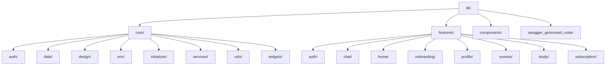

**中文** | [English](Architecture_en.md)

# TriTalk 前端架构

本文档描述了 TriTalk 前端应用程序的当前架构。

## 🏗 高层概述

TriTalk 采用了由 **Riverpod** 支持的 **功能优先、分层架构**，用于状态管理和依赖注入。

- **功能优先**: 代码库按业务领域（功能）而不是技术层组织。每个功能都是一个独立的模块。
- **分层**: 在每个功能中，代码被分为 **领域 (Domain)**、**数据 (Data)** 和 **表现 (Presentation)** 层，以强制执行适当的关注点分离。
- **响应式**: UI 是响应式的，监听由 Riverpod Notifiers 驱动的不可变状态更改。

### 技术栈

- **框架**: Flutter
- **状态管理 & 依赖注入**: `flutter_riverpod`
- **不可变性**: `freezed`
- **数据序列化**: `json_serializable`
- **API 客户端**: `chopper` (通过 `swagger_dart_code_generator` 生成)
- **后端**: Supabase (PostgreSQL + Auth + Storage)

---

## 📂 目录结构

`lib/` 目录组织如下：



### 1. 核心 (`lib/core/`)

包含跨多个功能或应用程序范围内基础设施共享的代码。

- **`auth/`**: 全局认证状态和逻辑 (例如 `AuthProvider`)。
- **`data/`**: 全局数据服务和客户端。
  - `api/`: HTTP 客户端, 拦截器, 基础 API 服务。
  - `local/`: 共享首选项 (Shared preferences), 安全存储 (secure storage), 数据库密钥。
- **`design/`**: 应用程序主题, 颜色, 排版和资产。
- **`env/`**: 环境配置 (例如 Dev vs. Prod)。
- **`initializer/`**: 应用程序启动逻辑 (Supabase 初始化, 特定服务预热)。
- **`services/`**: 全局后台服务 (例如 FCM 推送通知, SoLoud TTS 引擎)。
- **`utils/`**: 辅助函数和扩展。
- **`widgets/`**: 可重用的基础设施 UI 组件 (例如加载器, Toasts, 通用按钮)。

### 2. 功能 (`lib/features/`)

每个文件夹代表一项特定的业务能力。一个功能齐全的模块遵循此内部结构：

```text
features/chat/
├── data/                 # 数据层 (实现)
│   ├── *_service.dart    # 数据源 (API 客户端, 本地 DAOs)
│   └── repositories/     # 领域存储库的实现
├── domain/               # 领域层 (定义)
│   ├── models/           # Dart 数据类 (Freezed)
│   └── repositories/     # 抽象存储库接口
├── presentation/         # 表现层 (UI & 逻辑)
│   ├── notifiers/        # StateNotifiers / Notifiers (业务逻辑)
│   ├── pages/            # 全屏 Widgets (Scaffolds)
│   ├── state/            # UI 状态类 (Freezed)
│   └── widgets/          # 功能特定的 UI 组件
└── providers/            # 该功能的 Riverpod 提供者
```

> **注意**: 较简单的功能 (例如 `home/`, `onboarding/`) 如果没有定义自定义模型或存储库接口，可能会省略 `domain/` 或 `data/` 层。

### 3. 组件 (`lib/components/`)

包含独立的配置组件 (例如 `supabase_config.dart`)。

### 4. 生成的代码 (`lib/swagger_generated_code/`)

从 Swagger/OpenAPI 规范自动生成的 API 客户端代码，使用 `swagger_dart_code_generator`。**不要手动编辑** — 使用 `flutter pub run build_runner build` 重新生成。

---

## 🧱 层细节

### 1. 领域层 (`domain/`)

_功能稳定的核心。_

> **为什么叫 "Domain" (领域)?** 这个术语来自 [领域驱动设计 (DDD)](https://en.wikipedia.org/wiki/Domain-driven_design)，这是一种专注于建模软件以匹配业务领域的软件设计方法。"领域" 代表核心业务逻辑和规则 — 独立于 UI 框架 or 数据存储机制。

- **职责**: 定义功能 "做什么" 以及它使用 "什么" 数据。
- **内容**:
  - **模型**: 不可变数据结构 (例如 `ChatMessage`, `Scene`)。
  - **存储库 (接口)**: 定义数据操作的契约 (例如 `IChatRepository`)。
- **规则**: 纯 Dart 代码。没有 Flutter UI 导入。没有数据实现细节 (Http, SharedPreferences)。

### 2. 数据层 (`data/`)

_实现细节。_

- **职责**: 实现存储库接口以获取/存储数据。
- **内容**:
  - **存储库实现**: 实现 `IChatRepository`。它们协调从远程源 (API) 和本地源 (缓存) 获取数据。
  - **数据源**: 连接外部系统的直接连接器 (例如 `ChatApiService`, `ChatLocalService`)。
- **规则**: 依赖于领域层 (Domain)。

### 3. 表现层 (`presentation/`)

_用户界面和交互逻辑。_

- **职责**: 显示状态并处理用户输入。
- **内容**:
  - **页面**: 顶级屏幕。
  - **Widgets**: 可重用的 UI 片段。
  - **Notifiers (View Models)**: 扩展 `Notifier` 或 `StateNotifier` 的类。它们持有 [业务逻辑]。
  - **状态**: 代表任何时刻 UI 状态的不可变类 (例如 `ChatPageState`)。
- **规则**: 依赖于领域层 (Domain)。**绝不** 直接与数据层通信 (通过 DI 使用存储库)。

---

## 🔄 状态管理模式

我们使用 **Riverpod** 将这些层绑定在一起。

1.  **状态定义**: 使用 `Freezed` 定义。

    ```dart
    @freezed
    class ChatPageState with _$ChatPageState {
      const factory ChatPageState({
        @Default([]) List<ChatMessage> messages,
        @Default(false) bool isLoading,
      }) = _ChatPageState;
    }
    ```

2.  **Notifier**: 管理状态并处理逻辑。

    ```dart
    class ChatPageNotifier extends StateNotifier<ChatPageState> {
      final IChatRepository _repository;

      // 通过构造函数进行依赖注入
      ChatPageNotifier(this._repository) : super(const ChatPageState());

      Future<void> sendMessage(String text) async {
        state = state.copyWith(isLoading: true);
        await _repository.sendMessage(text);
        state = state.copyWith(isLoading: false);
      }
    }
    ```

3.  **UI 消费**:

    ```dart
    class ChatScreen extends ConsumerWidget {
      @override
      Widget build(BuildContext context, WidgetRef ref) {
        // 观察状态
        final state = ref.watch(chatPageProvider);

        // 触发逻辑
        return FloatingActionButton(
          onPressed: () => ref.read(chatPageProvider.notifier).sendMessage("Hello"),
          child: state.isLoading ? CircularProgressIndicator() : Icon(Icons.send),
        );
      }
    }
    ```
