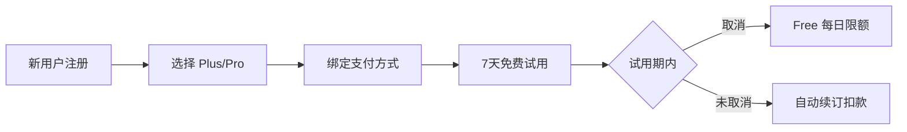

# TriTalk 定价策略方案

> **版本**: 1.2
> **日期**: 2026-01-19
> **状态**: 方案设计（未实现）
> **货币**: USD (美元)
> **参考**: [成本分析文档](../../docs/cost_analysis.md)

---

## 1. 成本分析

> [!IMPORTANT]
> 以下数据基于 [cost_analysis.md](../../docs/cost_analysis.md) 的实际测算。

### 1.1 综合成本汇总

| DAU 规模 | Cloudflare | Supabase | GCP TTS         | Azure Speech | **月总成本**       | **人均成本/月** |
| -------- | ---------- | -------- | --------------- | ------------ | ------------------ | --------------- |
| 开发阶段 | $0         | $0       | $0 (Free)       | $0           | **$0**             | -               |
| 100 DAU  | $0         | $0       | $0 (Free)       | ~$165        | **~$165**          | **~$1.65**      |
| 1000 DAU | $5         | $0-25    | $750-1,500\*    | $1,650       | **$2,400-3,200**   | **$2.4-3.2**    |
| 10K DAU  | $11        | $25      | $7,500-15,000\* | $16,500      | **$24,000-31,500** | **$2.4-3.15**   |

> \* TTS 成本假设 50% 缓存命中率；通过优化可进一步降低。

### 1.2 核心 API 单次成本

| 服务                    | 提供商       | 单次成本     |
| ----------------------- | ------------ | ------------ |
| TTS 语音合成 (10词句子) | GCP Gemini   | **$0.001**   |
| 发音评估 (10词句子)     | Azure Speech | **$0.001**   |
| 单词发音                | GCP Gemini   | **$0.00025** |

### 1.3 用户日均成本 (深度练习)

| 活动                | 日成本     | 月成本    |
| ------------------- | ---------- | --------- |
| TTS 句子朗读 (50句) | $0.05      | $1.5      |
| 发音评估 (50句)     | $0.055     | $1.65     |
| 单词发音 (100词)    | $0.025     | $0.75     |
| **总计**            | **~$0.13** | **~$3.9** |

### 1.4 各档位用户日均成本估算

> [!IMPORTANT]
> **成本策略调整**: 对话练习成本低,Plus/Pro 改为无限。跟读练习(发音评估+TTS)是成本大头,保持限额控制。

| 档位     | 每日使用量          | 日成本  | 月成本 | 定价   | 毛利率     |
| -------- | ------------------- | ------- | ------ | ------ | ---------- |
| **Free** | 3次对话+跟读        | ~$0.005 | ~$0.15 | $0     | -          |
| **Plus** | 无限对话 + 100次TTS | ~$0.14  | ~$4.32 | $9.99  | **57%** ✅ |
| **Pro**  | 无限对话 + 无限TTS  | ~$0.30  | ~$9.00 | $24.99 | **64%** ✅ |

> [!TIP]
> **TTS 成本控制 (Plus)**:
>
> - TTS 成本 ($0.001/句) 远高于文本。若 Plus 无限使用，极端情况下(每天300+句)会导致亏损。
> - **100次/天** 足以覆盖 1-1.5 小时正常语音交流，既保证体验又守住利润底线。
>
> **场景功能升级**:
>
> - 场景生成为一次性低成本操作。Pro 开放**无限创建**可极大提升尊贵感且风险极低。

---

## 2. 订阅方案

### 2.1 用户旅程



### 2.2 三档定价

> [!TIP]
> **策略 B**: 7 天免费试用 + 每日限额，平衡体验与成本。

| 计费方式                                                                        | 🆓 Free    | ⭐ Plus                                                                            | 💎 Pro                                                                              |
| :------------------------------------------------------------------------------ | :--------- | :--------------------------------------------------------------------------------- | :---------------------------------------------------------------------------------- |
| **按月订阅**                                                                    | 免费       | **$9.99 /月**<br><span style="color:grey;font-size:0.9em">(原价 $119.88/年)</span> | **$24.99 /月**<br><span style="color:grey;font-size:0.9em">(原价 $299.88/年)</span> |
| **按年订阅**<br><span style="color:#d93025;font-size:0.9em">🔥 限时 6 折</span> | -          | **$71.99 /年**<br><span style="color:#188038;font-size:0.9em">(立省 40%)</span>    | **$179.99 /年**<br><span style="color:#188038;font-size:0.9em">(立省 40%)</span>    |
| **核心限额**                                                                    | 3次对话/天 | ✅ 无限文本<br>100次TTS/天                                                         | ✅ 全无限<br>无限场景/TTS                                                           |

### 2.3 7 天免费试用（平台标准订阅模式）

> [!NOTE]
> 采用 **App Store / Google Play 标准订阅模式**，与主流应用一致。

| 项目           | 内容                               |
| -------------- | ---------------------------------- |
| **试用内容**   | 完整 Plus 功能                     |
| **试用时长**   | 7 天                               |
| **需绑定支付** | ✅ 平台要求                        |
| **试用结束**   | **自动续订扣款**（用户可提前取消） |
| **首月扣款**   | Plus $2.99 / Pro $9.99（首月优惠） |
| **试用成本**   | ~$0.50/用户                        |
| **预期转化率** | 10-15%（高于手动订阅）             |

**用户流程**:

```
注册 → 选择 Plus/Pro → 绑定支付 → 7天免费试用 → 自动续订
                                              ↓
                              （用户可在试用期内随时取消）
```

### 2.4 功能对比矩阵 (MVP 版本)

> [!NOTE]
> **设计理念**:
>
> - **Free**: 体验核心功能
> - **Plus**: 深度练习 (无限文本+语音，但TTS限100次防滥用)
> - **Pro**: 沉浸式母语环境 (完全无限，含无限场景创作)

| 功能模块     | 功能                   | 🆓 Free | 🔥 试用期  | ⭐ Plus    | 💎 Pro     |
| ------------ | ---------------------- | ------- | ---------- | ---------- | ---------- |
| **对话练习** | AI 对话次数            | 3次/天  | ✅ 无限制  | ✅ 无限制  | ✅ 无限制  |
|              | 语音输入               | 3次/天  | ✅ 无限制  | ✅ 无限制  | ✅ 无限制  |
| **跟读练习** | 发音评估次数           | 3次/天  | 20次/天    | 20次/天    | 100次/天   |
|              | 单词发音               | 10次/天 | ✅ 无限制  | ✅ 无限制  | ✅ 无限制  |
|              | 音高对比分析           | ❌      | ✅         | ✅         | ✅         |
| **语法分析** | 深度分析次数           | 3次/天  | ✅ 无限制  | ✅ 无限制  | ✅ 无限制  |
| **场景功能** | 预置场景               | 5个     | 全部(12个) | 全部(12个) | 全部(12个) |
|              | 自定义场景(含 AI 生成) | ❌      | 30个       | 30个       | ✅ 无限制  |
| **TTS 语音** | AI 消息朗读            | 3次/天  | 100次/天   | 100次/天   | ✅ 无限制  |

**💡 使用时长估算**:

- Free: 约 **5-8 分钟**/天
- Plus: 约 **1-1.5 小时**/天 (受限于 100次 TTS)
- Pro: **3-5 小时+** (真正无限畅聊)

**📍 预置场景列表**:

| Free (5个)    | Plus/Pro 解锁 (7个) |
| ------------- | ------------------- |
| ☕ 咖啡店点单 | ✈️ 机场值机         |
| 🚕 打车出行   | 🏨 酒店入住         |
| 🛒 超市购物   | 🗺️ 问路导航         |
| 🍽️ 餐厅点餐   | 💼 工作面试         |
| 👋 自我介绍   | 🤝 商务会议         |
|               | 🎬 电影讨论         |
|               | 🩺 看医生           |

**📌 第二版计划功能**（暂不差异化）:

- 对话历史保存限制
- 练习历史记录限制
- 词汇详解分级
- 收藏词汇导出

---

## 3. 定价策略

### 3.1 价格定位

| 方案     | 目标用户 | 核心卖点               | 成本覆盖                 |
| -------- | -------- | ---------------------- | ------------------------ |
| **Free** | 体验用户 | 低门槛尝试(~5分钟/天)  | 限额 $0.15/月            |
| **Plus** | 日常练习 | 无限文本+100次TTS语音  | $9.99 > $4.32 (含TTS) ✅ |
| **Pro**  | 重度用户 | 全功能无限(含场景/TTS) | $24.99 > $9.00 ✅        |

### 3.2 价格锚点

- **Plus $9.99/月**: 约等于两杯星巴克，日均 $0.33
- **Pro $24.99/月**: 低于一节外教课 ($30+)，性价比突出
- **年付优惠**: 享约 40% 折扣，提高用户 LTV

---

## 4. 转化策略

### 4.1 Free → Plus 触发点

| 触发场景             | 提示文案                                                                             |
| -------------------- | ------------------------------------------------------------------------------------ |
| 对话次数用尽         | "Upgrade to Plus for unlimited conversations and 20 daily pronunciation assessments" |
| 跟读评估用尽         | "Want more practice? Plus gives you 20 assessments/day + unlimited conversations"    |
| 尝试音高对比         | "Pitch contour analysis is a Plus feature"                                           |
| Pro 用户跟读接近限额 | "Incredible dedication! You've used 90+ pronunciation assessments today."            |

### 4.2 订阅激励

| 策略         | 时机/条件     | 描述                                                     |
| ------------ | ------------- | -------------------------------------------------------- |
| **首月优惠** | Day 6-7       | Plus **$2.99** / Pro **$9.99**（试用即将结束，限时优惠） |
|              | Day 8-14      | Plus $4.99 / Pro $14.99（错过限时后仍有折扣）            |
|              | Day 15+       | 原价（无优惠）                                           |
| **邀请返利** | 邀请好友注册  | 双方各得 7 天会员                                        |
| **学习成就** | 连续 7 天练习 | 解锁 10% 折扣                                            |
| **年付优惠** | 选择年付      | 享 40% 折扣，锁定长期用户                                |

> [!TIP]
> **首月优惠的价值**:
>
> - 转化率可提升 **50-100%**
> - 首月付费用户续费率**远高于**未付费用户
> - 成本约 $4-5/转化用户，可接受

---

## 5. A/B 测试建议

> [!WARNING]
> **不建议直接进行价格 A/B 测试**。不同用户看到不同价格容易引发投诉和信任危机。

### 5.1 推荐测试方式

| 测试类型        | 描述                   | 风险   |
| --------------- | ---------------------- | ------ |
| ✅ **限额测试** | 调整 Free 用户每日限额 | 低风险 |
| ✅ **功能测试** | 调整各档位功能差异     | 低风险 |
| ✅ **促销测试** | 不同首月优惠幅度       | 低风险 |
| ⚠️ **区域定价** | 不同国家/地区定价      | 需谨慎 |
| ❌ **价格 A/B** | 同区域不同用户不同价   | 高风险 |

### 5.2 限额测试

| 测试组 | Free 对话限额 | 测试目标   |
| ------ | ------------- | ---------- |
| A      | 10次/天       | 基准       |
| B      | 5次/天        | 更激进转化 |
| C      | 15次/天       | 更长体验期 |

### 5.3 促销测试

| 测试组 | 首月优惠               | 测试目标 |
| ------ | ---------------------- | -------- |
| A      | Plus $2.99 / Pro $9.99 | 基准转化 |
| B      | Plus $1.99 / Pro $6.99 | 低价引流 |
| C      | 7天免费试用            | 体验优先 |

---

## 6. 收入预估模型

### 6.1 关键假设

| 参数               | 假设值     | 说明               |
| ------------------ | ---------- | ------------------ |
| MAU (月活)         | 500-10,000 | 初创公司成长阶段   |
| DAU/MAU 比例       | 33%        | 日活约为月活的 1/3 |
| Free → Plus 转化率 | 5%         | 行业平均 3-8%      |
| Plus → Pro 转化率  | 15%        | 高价值用户比例     |
| Plus 单价          | $9.99/月   | 对标 HelloTalk VIP |
| Pro 单价           | $24.99/月  | 对标 ELSA Premium  |

### 6.2 不同规模收入预估

> [!NOTE]
> **早期阶段分析**: $68/月净利看似很少，但这说明**单位经济模型从第一天就是健康的**。
>
> - ✅ 毛利率 34% 与 SaaS 行业标准一致
> - ✅ GCP $25K 赠金可覆盖早期 TTS 成本，实际净利更高
> - ⚠️ 早期应关注**转化率**而非绝对利润

#### 🌱 早期阶段 (MAU 500)

| 方案     | 用户数     | 单价   | 月成本   | 月收入   | 净利      |
| -------- | ---------- | ------ | -------- | -------- | --------- |
| Free     | 475 (95%)  | $0     | $71      | $0       | -$71      |
| Plus     | 21 (4.25%) | $9.99  | $63      | $210     | +$147     |
| Pro      | 4 (0.75%)  | $24.99 | $32      | $100     | +$68      |
| 固定     | -          | -      | $3       | -        | -$3       |
| **合计** | 500        | -      | **$169** | **$310** | **+$141** |

毛利率: **45%** ✅

#### 🌿 成长阶段 (MAU 1,000)

| 方案     | 用户数     | 单价   | 月成本   | 月收入   | 净利      |
| -------- | ---------- | ------ | -------- | -------- | --------- |
| Free     | 950 (95%)  | $0     | $143     | $0       | -$143     |
| Plus     | 43 (4.25%) | $9.99  | $129     | $430     | +$301     |
| Pro      | 7 (0.75%)  | $24.99 | $56      | $175     | +$119     |
| 固定     | -          | -      | $3       | -        | -$3       |
| **合计** | 1,000      | -      | **$331** | **$605** | **+$274** |

毛利率: **45%** ✅

#### 🌳 发展阶段 (MAU 3,000)

| 方案     | 用户数      | 单价   | 月成本   | 月收入     | 净利      |
| -------- | ----------- | ------ | -------- | ---------- | --------- |
| Free     | 2,850 (95%) | $0     | $428     | $0         | -$428     |
| Plus     | 128 (4.25%) | $9.99  | $384     | $1,279     | +$895     |
| Pro      | 22 (0.75%)  | $24.99 | $176     | $550       | +$374     |
| 固定     | -           | -      | $9       | -          | -$9       |
| **合计** | 3,000       | -      | **$997** | **$1,829** | **+$832** |

毛利率: **45%** ✅

#### 🚀 规模阶段 (MAU 10,000)

| 方案     | 用户数      | 单价   | 月成本     | 月收入     | 净利        |
| -------- | ----------- | ------ | ---------- | ---------- | ----------- |
| Free     | 9,500 (95%) | $0     | $1,425     | $0         | -$1,425     |
| Plus     | 425 (4.25%) | $9.99  | $1,275     | $4,246     | +$2,971     |
| Pro      | 75 (0.75%)  | $24.99 | $600       | $1,874     | +$1,274     |
| 固定     | -           | -      | $30        | -          | -$30        |
| **合计** | 10,000      | -      | **$3,330** | **$6,120** | **+$2,790** |

毛利率: **45%** ✅

### 6.3 成长路径汇总

| 阶段    | MAU    | 时间周期 | 月收入 | 月成本 | 月净利  | 年化收入 |
| ------- | ------ | -------- | ------ | ------ | ------- | -------- |
| 🌱 早期 | 500    | 3-6 月   | $310   | $169   | +$141   | ~$3,720  |
| 🌿 成长 | 1,000  | 6-12 月  | $605   | $331   | +$274   | ~$7,260  |
| 🌳 发展 | 3,000  | 12-18 月 | $1,829 | $997   | +$832   | ~$21,948 |
| 🚀 规模 | 10,000 | 18-24 月 | $6,120 | $3,330 | +$2,790 | ~$73,440 |

### 6.4 各阶段目标与关键指标

| 阶段    | 主要目标             | 关键指标                   |
| ------- | -------------------- | -------------------------- |
| 🌱 早期 | 产品验证、种子用户   | 留存率 > 30%，NPS > 30     |
| 🌿 成长 | PMF 验证、付费转化   | 转化率 > 3%，MRR 稳定增长  |
| 🌳 发展 | 规模化获客、优化转化 | CAC < LTV/3，转化率 > 5%   |
| 🚀 规模 | 市场扩展、盈利优化   | 毛利率 > 40%，月增长 > 10% |

### 6.5 转化率敏感性分析 (MAU 3,000)

| 场景 | 转化率 | 月收入 | 月净利  |
| ---- | ------ | ------ | ------- |
| 悲观 | 3%     | $1,098 | +$101   |
| 基准 | 5%     | $1,829 | +$832   |
| 乐观 | 8%     | $2,926 | +$1,929 |

---

## 7. 竞品参考

| 产品           | 订阅档位     | 价格 (USD)    | 核心功能与限制                                                   |
| -------------- | ------------ | ------------- | ---------------------------------------------------------------- |
| **Speak**      | Premium      | $19.99/月     | 核心课程、AI 导师、角色扮演 (限制自定义课程额度)                 |
|                | Premium Plus | $29.99/月     | **无限**自定义课程、个性化复习 (Made for You)、进阶 AI 反馈      |
| **Duolingo**   | Super        | $12.99/月     | 去广告、无限红心 (Free限5红心/天)、错题本                        |
|                | Max          | $29.99/月     | **AI 功能**: 解释答案 (Explain My Answer)、角色扮演 (Roleplay)   |
| **HelloTalk**  | VIP          | $12.99/月     | 无限翻译 (Free限10次/天)、无限新语伴 (Free限10人/天)、学3门语言  |
| **ELSA Speak** | Pro          | $11.99/月     | 1600+ 课程、发音细节评分 (每日限额 AI 对话)                      |
|                | Premium      | $19.99/月     | **无限** AI Roleplay、Speech Analyzer (语音分析器)、考试备考     |
| **TriTalk**    | Plus         | **$9.99/月**  | AI 对话 (20次/天) + 发音评估 (20次/天) + 语法分析                |
|                | Pro          | **$24.99/月** | 几乎无限 (100次/天)，沉浸式学习，高性价比替代 Speak Premium Plus |

> **定位**:
>
> - **Plus ($9.99)**: 仅为 Speak Premium ($19.99) 的 **半价**，且比 ELSA Pro/HelloTalk VIP 更便宜，提供完整 AI 对话体验。
> - **Pro ($24.99)**: 比 Speak Premium Plus / Duolingo Max ($29.99) 便宜 **$5/月**，提供同级别的沉浸式 AI 练习。
> - **差异化**: AI 对话 + 发音评估 + 语法分析三合一，无需多个 App。
> - **透明定价**: 明确限额而非“无限”，避免滥用，保证服务质量。

---

## 8. 实施优先级

| 阶段    | 任务                        | 优先级 |
| ------- | --------------------------- | ------ |
| Phase 1 | 用量统计和限额系统          | P0     |
| Phase 1 | 接入支付 (Apple/Google IAP) | P0     |
| Phase 2 | 订阅状态管理                | P0     |
| Phase 2 | 付费引导 UI                 | P1     |
| Phase 3 | A/B 测试框架                | P2     |

---

## 9. 风险与应对

| 风险           | 应对策略                    |
| -------------- | --------------------------- |
| API 成本超预期 | 硬限额 + 动态调整 Free 额度 |
| 付费转化率低   | 优化 onboarding + 突出价值  |
| 用户流失率高   | 学习提醒 + 打卡奖励         |
| 竞品价格战     | 差异化功能 + 内容壁垒       |

---

## 10. 前端实现 (Frontend Implementation)

已在 `frontend/lib/features/subscription/` 下实现了完整的付费门槛控制机制。

### 10.1 核心组件 （已完成）

- **`FeatureGate`** (`presentation/feature_gate.dart`): 单例拦截器，统一处理权限检查和 Paywall 触发。
- **`UsageService`** (`domain/services/usage_service.dart`): 用量追踪接口，用于统计每日使用次数。
- **`PaywallRoute`** (`presentation/paywall_route.dart`): 路由辅助类。

### 10.2 功能枚举 (PaidFeature) （已完成）

位于 `domain/models/paid_feature.dart`:

```dart
enum PaidFeature {
  // --- 次数限制类 (Quota Limited) ---
  dailyConversation,    // AI 对话
  voiceInput,           // 语音输入
  speechAssessment,     // 发音评估
  wordPronunciation,    // 单词发音
  grammarAnalysis,      // 语法分析
  ttsSpeak,             // TTS 朗读

  // --- 访问权限类 (Gatekeepers) ---
  pitchAnalysis,        // 音高分析 (仅 Plus/Pro)
  customScenarios,      // 自定义场景 (Free不可创建)
}
```

### 10.3 使用方法 (Usage)

`FeatureGate().performWithFeatureCheck` 支持两种调用方式：**回调模式**（适合同步 UI 操作）和 **Await 模式**（适合异步 API 调用）。

**方式 1：回调模式 (Callback Style)** - 适合导航、简单的 UI 更新

```dart
// 示例：点击"创建场景"按钮
FeatureGate().performWithFeatureCheck(
  context,
  feature: PaidFeature.customScenarios,
  onGranted: () {
    // ✅ 权限验证通过，执行原有逻辑
    Navigator.pushNamed(context, '/create_scenario');
  },
);
```

**方式 2：Await 模式 (Async/Await Style)** - 适合异步操作 (如发送请求)

```dart
// 示例：发送聊天消息
void _sendMessage() async {
  // 1. 先检查权限
  final granted = await FeatureGate().performWithFeatureCheck(
    context,
    feature: PaidFeature.dailyConversation,
    // ...
  );

  // 2. 根据结果执行异步逻辑
  if (granted) {
    await chatNotifier.sendChat(text);
  }
}
```

### 10.4 内部逻辑流程

方法签名：`Future<bool> performWithFeatureCheck(...)`

1. **检查 Debug 标记**: 若 `Env.forcePaywall` 为 true，强制弹窗，返回 `false`。
2. **检查硬性门槛 (Gatekeeping)**:
   - 例如 `pitchAnalysis` 必须是 Plus 或 Pro 用户。
   - 不满足 -> 弹出 Paywall。
3. **检查每日限额 (Quota Check)**:
   - 读取 `UsageService` 获取今日已用次数。
   - 对比当前等级的配额 (Free/Plus/Pro)。
   - 已超限 -> 弹出 Paywall。
4. **结果处理**:
   - **通过/已付费** -> 调用 `onGranted` (如有)，并返回 `true`。
   - **取消/未付费** -> 调用 `onPaywallCancelled` (如有)，并返回 `false`。

### 10.5 配额配置 (FeatureGate)

目前配额策略硬编码在 `FeatureGate.getQuotaLimit` 中，作为本地兜底。

> **注意**: `UsageServiceImpl` 目前使用内存缓存 (`_usageCounts`)，重启 App 会重置。
> **TODO**: 需要对接 `SharedPreferences` 或后端 API 实现持久化和跨端同步。

```dart
// 伪代码逻辑
int getQuotaLimit(PaidFeature feature) {
  final tier = RevenueCatService().currentTier;
  // ... 根据 Tier 返回 3, 20, 100 或 -1 (无限)
}
```

### 10.6 Integration Points (Checklist) (已完成)

> [!IMPT]
> 以下是所有需要接入 `FeatureGate().performWithFeatureCheck` 的代码位置。

| Feature Enum          | Core Component | File Path                                                      | Method / Trigger                   | Recommended Style      | Notes                                      |
| :-------------------- | :------------- | :------------------------------------------------------------- | :--------------------------------- | :--------------------- | :----------------------------------------- |
| **customScenarios**   | Home Screen    | `features/home/presentation/pages/home_screen.dart`            | `FloatingActionButton.onPressed`   | **Style 1 (Callback)** | 点击"+"号创建新场景前检查 (Navigation)     |
| **dailyConversation** | Chat Screen    | `features/chat/presentation/pages/chat_screen.dart`            | `_sendMessage`                     | **Style 2 (Await)**    | 发送文本消息前检查 (Async API)             |
| **voiceInput**        | Chat Screen    | `features/chat/presentation/pages/chat_screen.dart`            | `_startVoiceRecording`             | **Style 2 (Await)**    | 点击麦克风开始录音前检查 (Async Logic)     |
| **speechAssessment**  | Chat Screen    | `features/chat/presentation/pages/chat_screen.dart`            | `_handleUserMessageAnalysis`       | **Style 2 (Await)**    | 点击"Analyze" (Voice Msg) 前检查 (API)     |
| **speechAssessment**  | Shadowing      | `features/study/presentation/widgets/shadowing_sheet.dart`     | `_stopRecording` / `_analyzeAudio` | **Style 2 (Await)**    | 跟读录音结束分析前检查 (API)               |
| **grammarAnalysis**   | Chat Screen    | `features/chat/presentation/pages/chat_screen.dart`            | `_handleUserMessageAnalysis`       | **Style 2 (Await)**    | 点击"Analyze" (Text Msg) 前检查 (API)      |
| **grammarAnalysis**   | Chat Screen    | `features/chat/presentation/pages/chat_screen.dart`            | `_handleAnalyze`                   | **Style 2 (Await)**    | 点击 AI 消息的 "Analyze" 前检查 (API)      |
| **grammarAnalysis**   | Chat Screen    | `features/chat/presentation/pages/chat_screen.dart`            | `_optimizeMessage`                 | **Style 2 (Await)**    | 点击"魔法棒" (AI Rewrite) 前检查 (API)     |
| **ttsSpeak**          | Chat Bubble    | `features/chat/presentation/widgets/chat_bubble.dart`          | `_playPauseVoice` or Speaker Icon  | **Style 2 (Await)**    | 点击消息朗读 (Speaker Icon) 前检查 (Audio) |
| **ttsSpeak**          | Shadowing      | `features/study/presentation/widgets/shadowing_sheet.dart`     | `_playTextToSpeech`                | **Style 2 (Await)**    | 点击播放原句音频前检查 (Audio)             |
| **wordPronunciation** | Vocab List     | `features/study/presentation/widgets/vocab_list_widget.dart`   | `_playWordPronunciation`           | **Style 2 (Await)**    | 点击单词播放发音时检查 (Audio)             |
| **wordPronunciation** | Feedback       | `features/chat/presentation/widgets/voice_feedback_sheet.dart` | `_playWordPronunciation`           | **Style 2 (Await)**    | 点击单词播放发音时检查 (Audio)             |
| **wordPronunciation** | Analysis       | `features/study/presentation/widgets/analysis_sheet.dart`      | `_playWordPronunciation`           | **Style 2 (Await)**    | 点击单词播放发音时检查 (Audio)             |
| **wordPronunciation** | Favorites      | `features/profile/presentation/widgets/favorites_sheet.dart`   | `_playWordPronunciation`           | **Style 2 (Await)**    | 点击单词播放发音时检查 (Audio)             |
| **pitchAnalysis**     | Feedback       | `features/chat/presentation/widgets/voice_feedback_sheet.dart` | `_buildIntonation` (UI)            | **Style 1 (Callback)** | 解锁后刷新 UI (setState)                   |

**Reference Styles**:

```dart
// Style 1: Callback (Synchronous UI actions like Navigation)
FeatureGate().performWithFeatureCheck(
  context,
  feature: PaidFeature.customScenarios,
  onGranted: () => Navigator.pushNamed(context, '...'),
);

// Style 2: Await (Async API calls)
if (await FeatureGate().performWithFeatureCheck(context, feature: ...)) {
  await chatNotifier.sendChat(text);
}
```
