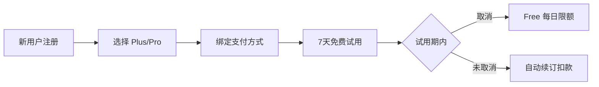

## 2. 订阅方案

### 2.1 用户旅程



### 2.2 三档定价

> [!TIP]
> **策略 B**: 7 天免费试用 + 每日限额，平衡体验与成本。

| 计费方式                                                                        | 🆓 Free    | ⭐ Plus                                                                            | 💎 Pro                                                                              |
| :------------------------------------------------------------------------------ | :--------- | :--------------------------------------------------------------------------------- | :---------------------------------------------------------------------------------- |
| **按月订阅**                                                                    | 免费       | **$9.99 /月**<br><span style="color:grey;font-size:0.9em">(原价 $119.88/年)</span> | **$24.99 /月**<br><span style="color:grey;font-size:0.9em">(原价 $299.88/年)</span> |
| **按年订阅**<br><span style="color:#d93025;font-size:0.9em">🔥 限时 6 折</span> | -          | **$71.99 /年**<br><span style="color:#188038;font-size:0.9em">(立省 40%)</span>    | **$179.99 /年**<br><span style="color:#188038;font-size:0.9em">(立省 40%)</span>    |
| **每日限额**                                                                    | 3次对话/天 | 20次对话/天                                                                        | 100次对话/天                                                                        |

### 2.3 7 天免费试用（平台标准订阅模式）

> [!NOTE]
> 采用 **App Store / Google Play 标准订阅模式**，与主流应用一致。

| 项目           | 内容                               |
| -------------- | ---------------------------------- |
| **试用内容**   | 完整 Plus 功能                     |
| **试用时长**   | 7 天                               |
| **需绑定支付** | ✅ 平台要求                        |
| **试用结束**   | **自动续订扣款**（用户可提前取消） |
| **首月扣款**   | Plus $2.99 / Pro $9.99（首月优惠） |
| **试用成本**   | ~$0.50/用户                        |
| **预期转化率** | 10-15%（高于手动订阅）             |

**用户流程**:

```
注册 → 选择 Plus/Pro → 绑定支付 → 7天免费试用 → 自动续订
                                              ↓
                              （用户可在试用期内随时取消）
```

### 2.4 功能对比矩阵 (MVP 版本)

> [!NOTE]
> **设计理念**: 量大管饱，消除用量焦虑。
>
> - **Free**: ~5 分钟 (体验核心功能)
> - **Plus**: ~50 分钟 (超值日常练习)
> - **Pro**: ~4 小时 (沉浸式母语环境)

| 功能模块     | 功能                     | 🔥 试用期  | 🆓 Free | ⭐ Plus    | 💎 Pro     |
| ------------ | ------------------------ | ---------- | ------- | ---------- | ---------- |
| **对话练习** | AI 对话次数              | 20次/天    | 3次/天  | 20次/天    | 100次/天   |
|              | 语音输入                 | 20次/天    | 3次/天  | 20次/天    | 100次/天   |
| **跟读练习** | 发音评估次数             | 20次/天    | 3次/天  | 20次/天    | 100次/天   |
|              | 单词发音                 | ✅ 无限制  | 10次/天 | ✅ 无限制  | ✅ 无限制  |
|              | 音高对比分析             | ✅         | ❌      | ✅         | ✅         |
| **语法分析** | 深度分析次数             | 20次/天    | 3次/天  | 20次/天    | 100次/天   |
| **场景功能** | 预置场景                 | 全部(12个) | 5个     | 全部(12个) | 全部(12个) |
|              | 自定义场景（含 AI 生成） | 10个       | ❌      | 10个       | 50个       |
| **TTS 语音** | AI 消息朗读              | 20次/天    | 3次/天  | 20次/天    | 100次/天   |

**💡 使用时长估算**:

- Free (3次对话): 约 **5-8 分钟**/天
- Plus (20次对话): 约 **45-60 分钟**/天
- Pro (100次对话): 约 **3-4 小时**/天

**📍 预置场景列表**:

| Free (5个)    | Plus/Pro 解锁 (7个) |
| ------------- | ------------------- |
| ☕ 咖啡店点单 | ✈️ 机场值机         |
| 🚕 打车出行   | 🏨 酒店入住         |
| 🛒 超市购物   | 🗺️ 问路导航         |
| 🍽️ 餐厅点餐   | 💼 工作面试         |
| 👋 自我介绍   | 🤝 商务会议         |
|               | 🎬 电影讨论         |
|               | 🩺 看医生           |

**📌 第二版计划功能**（暂不差异化）:

- 对话历史保存限制
- 练习历史记录限制
- 词汇详解分级
- 收藏词汇导出

---

## 3. 定价策略

### 3.1 价格定位

| 方案     | 目标用户 | 核心卖点                | 成本覆盖             |
| -------- | -------- | ----------------------- | -------------------- |
| **Free** | 体验用户 | 低门槛尝试（~5分钟/天） | 限额控制在 $0.15/月  |
| **Plus** | 日常练习 | 物超所值（~1小时/天）   | $9.99 > $1.32成本 ✅ |
| **Pro**  | 重度用户 | 几乎无限（~4小时/天）   | $24.99 > $6.6成本 ✅ |

### 3.2 价格锚点

- **Plus $9.99/月**: 约等于两杯星巴克，日均 $0.33
- **Pro $24.99/月**: 低于一节外教课 ($30+)，性价比突出
- **年付优惠**: 享约 40% 折扣，提高用户 LTV

---

## 4. 转化策略

### 4.1 Free → Plus 触发点

| 触发场景         | 提示文案                                                           |
| ---------------- | ------------------------------------------------------------------ |
| 对话次数用尽     | "Upgrade to Plus for 20 daily lessons (almost 1 hour of practice)" |
| 跟读评估用尽     | "Want more practice? Plus gives you 20 assessments/day"            |
| 尝试音高对比     | "Pitch contour analysis is a Plus feature"                         |
| Pro 用户接近限额 | "Incredible dedication! You've reached the 100 daily limit."       |

### 4.2 订阅激励

| 策略         | 时机/条件     | 描述                                                     |
| ------------ | ------------- | -------------------------------------------------------- |
| **首月优惠** | Day 6-7       | Plus **$2.99** / Pro **$9.99**（试用即将结束，限时优惠） |
|              | Day 8-14      | Plus $4.99 / Pro $14.99（错过限时后仍有折扣）            |
|              | Day 15+       | 原价（无优惠）                                           |
| **邀请返利** | 邀请好友注册  | 双方各得 7 天会员                                        |
| **学习成就** | 连续 7 天练习 | 解锁 10% 折扣                                            |
| **年付优惠** | 选择年付      | 享 40% 折扣，锁定长期用户                                |

> [!TIP]
> **首月优惠的价值**:
>
> - 转化率可提升 **50-100%**
> - 首月付费用户续费率**远高于**未付费用户
> - 成本约 $4-5/转化用户，可接受

---

## 8. 实施优先级

| 阶段    | 任务                        | 优先级 |
| ------- | --------------------------- | ------ |
| Phase 1 | 用量统计和限额系统          | P0     |
| Phase 1 | 接入支付 (Apple/Google IAP) | P0     |
| Phase 2 | 订阅状态管理                | P0     |
| Phase 2 | 付费引导 UI                 | P1     |
| Phase 3 | A/B 测试框架                | P2     |

---

## 9. 风险与应对

| 风险           | 应对策略                    |
| -------------- | --------------------------- |
| API 成本超预期 | 硬限额 + 动态调整 Free 额度 |
| 付费转化率低   | 优化 onboarding + 突出价值  |
| 用户流失率高   | 学习提醒 + 打卡奖励         |
| 竞品价格战     | 差异化功能 + 内容壁垒       |

---

## 10. 前端实现设计 (Frontend Implementation)

为了支持 UI 层的 Paywall 流程开发，建议在 `RevenueCatService` 和逻辑层实现以下辅助机制。

### 10.1 功能枚举定义 (PaidFeature)

明确所有受限的功能点，便于代码引用。

```dart
enum PaidFeature {
  // --- 次数限制类 (Quota Limited) ---
  dailyConversation,    // AI 对话 (每日会话/消息数)
  voiceInput,           // 语音输入
  speechAssessment,     // 句子发音评估
  wordPronunciation,    // 单词发音 (Free: 10/day, Plus/Pro: Unlimited)
  grammarAnalysis,      // 语法深度分析
  ttsSpeak,             // AI 消息朗读

  // --- 访问权限类 (Gatekeepers) ---
  pitchAnalysis,        // 音高对比分析 (仅 Plus/Pro)
  customScenarios,      // 自定义场景 (Free: 不可创建, Plus: 10个, Pro: 50个)
}
```

### 10.2 权限判断辅助方法 (Design Logic)

建议在 `RevenueCatService` 或 `SubscriptionService` 中扩展以下方法：

#### A. 获取权益限额 (Quota Configuration)

> [!IMPORTANT]
> **Source of Truth**: 配额数值应由 **后端 API** (如 `/config` 或 `/user/profile`) 下发，以支持动态运营调整。
> 前端应优先读取后端配置，以下逻辑仅作为 **Default/Fallback**。

```dart
/// 获取当前用户的配额（优先读取后端配置，返回 -1 代表无限制）
int getQuotaLimit(PaidFeature feature) {
  // 1. 尝试读取后端动态配置
  // int? remoteLimit = AppConfig.current.getLimit(feature, currentTier);
  // if (remoteLimit != null) return remoteLimit;

  // 2. 本地兜底策略 (Default Fallback)
  final tier = currentTier;
  switch (feature) {
    case PaidFeature.dailyConversation:
    case PaidFeature.voiceInput:
    case PaidFeature.speechAssessment:
    case PaidFeature.grammarAnalysis:
    case PaidFeature.ttsSpeak:
      if (tier == SubscriptionTier.pro) return 100;
      if (tier == SubscriptionTier.plus) return 20;
      return 3; // Free

    case PaidFeature.wordPronunciation:
      if (tier == SubscriptionTier.free) return 10;
      return -1; // Plus/Pro 无限制

    case PaidFeature.customScenarios:
      if (tier == SubscriptionTier.pro) return 50;
      if (tier == SubscriptionTier.plus) return 10;
      return 0; // Free 不可创建

    default:
      return 0; // 默认无额度/不支持
  }
}
```

#### B. 检查功能可用性 (UI Helpers)

用于 UI 组件决定是执行操作、显示锁图标，还是弹出 Paywall。

```dart
/// 检查是否**有资格**使用某功能 (不包含用量检查)
/// 主要用于显示 UI 锁头图标 (例如 Custom Scenario 按钮在 Free版 会显示锁)
bool hasAccess(PaidFeature feature) {
   if (feature == PaidFeature.pitchAnalysis) {
     return hasPlus; // 必须是 Plus 或以上
   }
   if (feature == PaidFeature.customScenarios) {
     return hasPlus; // 必须是 Plus 或以上才能创建
   }
   return true; // 次数限制类功能对所有人开放访问，只是额度不同
}
```

### 10.3 Paywall 触发流程 (UI Flow)

封装一个通用的拦截器，供 UI 层调用。

```dart
/// 尝试执行受限操作
///
/// 用于按钮点击事件。
/// 1. 检查 Feature 权限 (如 Free 用户点击创建自定义场景 -> 弹 Paywall)
/// 2. 检查 剩余次数 (如 Free 用户第 4 次发音评估 -> 弹 Paywall)
/// 3. 通过 -> 执行 [onGranted]
void performRestrictedAction(
  BuildContext context, {
  required PaidFeature feature,
  required VoidCallback onGranted,
  VoidCallback? onPaywallCancelled,
}) {
  // 0. 开发调试: 强制 Paywall
  // 需要在 Env 中添加 forcePaywall 变量
  if (Env.forcePaywall) {
    PaywallRoute.show(context, reason: "Debug: Force Paywall");
    return;
  }

  // 1. 检查硬性门槛 (Gatekeeping)
  if (!hasAccess(feature)) {
    // Show Paywall (Reason: Unlock Feature)
    PaywallRoute.show(context, reason: "Unlock ${feature.name}");
    return;
  }

  // 2. 检查剩余次数 (Quota Check)
  //此处需结合后端的计数器或本地计数缓存
  int limit = getQuotaLimit(feature);
  int used = _usageService.getUsedCount(feature);

  if (limit != -1 && used >= limit) {
    // Show Paywall (Reason: Quota Exceeded)
    PaywallRoute.show(context, reason: "Daily limit reached");
    return;
  }

  // 3. 通过
  onGranted();
}
```
