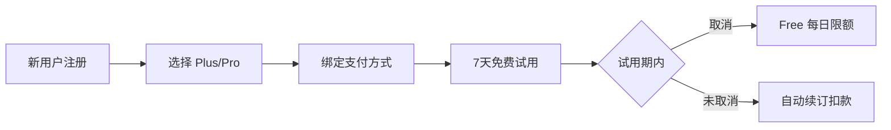

## 2. 订阅方案

### 2.1 用户旅程



### 2.2 三档定价

> [!TIP]
> **策略 B**: 7 天免费试用 + 每日限额，平衡体验与成本。

| 计费方式                                                                        | 🆓 Free    | ⭐ Plus                                                                            | 💎 Pro                                                                              |
| :------------------------------------------------------------------------------ | :--------- | :--------------------------------------------------------------------------------- | :---------------------------------------------------------------------------------- |
| **按月订阅**                                                                    | 免费       | **$9.99 /月**<br><span style="color:grey;font-size:0.9em">(原价 $119.88/年)</span> | **$24.99 /月**<br><span style="color:grey;font-size:0.9em">(原价 $299.88/年)</span> |
| **按年订阅**<br><span style="color:#d93025;font-size:0.9em">🔥 限时 6 折</span> | -          | **$71.99 /年**<br><span style="color:#188038;font-size:0.9em">(立省 40%)</span>    | **$179.99 /年**<br><span style="color:#188038;font-size:0.9em">(立省 40%)</span>    |
| **每日限额**                                                                    | 3次对话/天 | 20次对话/天                                                                        | 100次对话/天                                                                        |

### 2.3 7 天免费试用（平台标准订阅模式）

> [!NOTE]
> 采用 **App Store / Google Play 标准订阅模式**，与主流应用一致。

| 项目           | 内容                               |
| -------------- | ---------------------------------- |
| **试用内容**   | 完整 Plus 功能                     |
| **试用时长**   | 7 天                               |
| **需绑定支付** | ✅ 平台要求                        |
| **试用结束**   | **自动续订扣款**（用户可提前取消） |
| **首月扣款**   | Plus $2.99 / Pro $9.99（首月优惠） |
| **试用成本**   | ~$0.50/用户                        |
| **预期转化率** | 10-15%（高于手动订阅）             |

**用户流程**:

```
注册 → 选择 Plus/Pro → 绑定支付 → 7天免费试用 → 自动续订
                                              ↓
                              （用户可在试用期内随时取消）
```

### 2.4 功能对比矩阵 (MVP 版本)

> [!NOTE]
> **设计理念**: 量大管饱，消除用量焦虑。
>
> - **Free**: ~5 分钟 (体验核心功能)
> - **Plus**: ~50 分钟 (超值日常练习)
> - **Pro**: ~4 小时 (沉浸式母语环境)

| 功能模块     | 功能                     | 🔥 试用期  | 🆓 Free | ⭐ Plus    | 💎 Pro     |
| ------------ | ------------------------ | ---------- | ------- | ---------- | ---------- |
| **对话练习** | AI 对话次数              | 20次/天    | 3次/天  | 20次/天    | 100次/天   |
|              | 语音输入                 | 20次/天    | 3次/天  | 20次/天    | 100次/天   |
| **跟读练习** | 发音评估次数             | 20次/天    | 3次/天  | 20次/天    | 100次/天   |
|              | 单词发音                 | ✅ 无限制  | 10次/天 | ✅ 无限制  | ✅ 无限制  |
|              | 音高对比分析             | ✅         | ❌      | ✅         | ✅         |
| **语法分析** | 深度分析次数             | 20次/天    | 3次/天  | 20次/天    | 100次/天   |
| **场景功能** | 预置场景                 | 全部(12个) | 5个     | 全部(12个) | 全部(12个) |
|              | 自定义场景（含 AI 生成） | 10个       | ❌      | 10个       | 50个       |
| **TTS 语音** | AI 消息朗读              | 20次/天    | 3次/天  | 20次/天    | 100次/天   |

**💡 使用时长估算**:

- Free (3次对话): 约 **5-8 分钟**/天
- Plus (20次对话): 约 **45-60 分钟**/天
- Pro (100次对话): 约 **3-4 小时**/天

**📍 预置场景列表**:

| Free (5个)    | Plus/Pro 解锁 (7个) |
| ------------- | ------------------- |
| ☕ 咖啡店点单 | ✈️ 机场值机         |
| 🚕 打车出行   | 🏨 酒店入住         |
| 🛒 超市购物   | 🗺️ 问路导航         |
| 🍽️ 餐厅点餐   | 💼 工作面试         |
| 👋 自我介绍   | 🤝 商务会议         |
|               | 🎬 电影讨论         |
|               | 🩺 看医生           |

**📌 第二版计划功能**（暂不差异化）:

- 对话历史保存限制
- 练习历史记录限制
- 词汇详解分级
- 收藏词汇导出

---

## 3. 定价策略

### 3.1 价格定位

| 方案     | 目标用户 | 核心卖点                | 成本覆盖             |
| -------- | -------- | ----------------------- | -------------------- |
| **Free** | 体验用户 | 低门槛尝试（~5分钟/天） | 限额控制在 $0.15/月  |
| **Plus** | 日常练习 | 物超所值（~1小时/天）   | $9.99 > $1.32成本 ✅ |
| **Pro**  | 重度用户 | 几乎无限（~4小时/天）   | $24.99 > $6.6成本 ✅ |

### 3.2 价格锚点

- **Plus $9.99/月**: 约等于两杯星巴克，日均 $0.33
- **Pro $24.99/月**: 低于一节外教课 ($30+)，性价比突出
- **年付优惠**: 享约 40% 折扣，提高用户 LTV

---

## 4. 转化策略

### 4.1 Free → Plus 触发点

| 触发场景         | 提示文案                                                           |
| ---------------- | ------------------------------------------------------------------ |
| 对话次数用尽     | "Upgrade to Plus for 20 daily lessons (almost 1 hour of practice)" |
| 跟读评估用尽     | "Want more practice? Plus gives you 20 assessments/day"            |
| 尝试音高对比     | "Pitch contour analysis is a Plus feature"                         |
| Pro 用户接近限额 | "Incredible dedication! You've reached the 100 daily limit."       |

### 4.2 订阅激励

| 策略         | 时机/条件     | 描述                                                     |
| ------------ | ------------- | -------------------------------------------------------- |
| **首月优惠** | Day 6-7       | Plus **$2.99** / Pro **$9.99**（试用即将结束，限时优惠） |
|              | Day 8-14      | Plus $4.99 / Pro $14.99（错过限时后仍有折扣）            |
|              | Day 15+       | 原价（无优惠）                                           |
| **邀请返利** | 邀请好友注册  | 双方各得 7 天会员                                        |
| **学习成就** | 连续 7 天练习 | 解锁 10% 折扣                                            |
| **年付优惠** | 选择年付      | 享 40% 折扣，锁定长期用户                                |

> [!TIP]
> **首月优惠的价值**:
>
> - 转化率可提升 **50-100%**
> - 首月付费用户续费率**远高于**未付费用户
> - 成本约 $4-5/转化用户，可接受

---

## 5. 竞品分析 (Competitor Analysis)

### 5.1 主要竞品：Speak

**Speak** 是目前 AI 口语领域的头部产品，主打 AI 模拟真人对话。

| 订阅方案 | 价格 (月付) | 价格 (年付) | 核心功能与限制 |
| :--- | :--- | :--- | :--- |
| **Free / Trial** | 免费 | - | - 7天免费试用 (需绑定支付)<br>- 基础课程试听<br>- 极低限额的对话体验 |
| **Premium** | **$19.99/mo** | **$119.99/yr**<br>(~$10/mo) | - ✅ 解锁所有核心课程 (Core Lessons)<br>- ✅ AI 导师 (基础版)<br>- ✅ 角色扮演 (Roleplay) & 自由对话<br>- ✅ 实时语音纠正<br>- ⚠️ **限制**: 自定义 AI 课程 (Custom Lessons) 有额度限制 |
| **Premium Plus** | **$29.99/mo** | **$179.99/yr**<br>(~$15/mo) | - ✅ 包含 Premium 所有功能<br>- 🔥 **无限量** 自定义 AI 课程<br>- 🔥 个性化复习 (Made for You)<br>- 🔥 进阶 AI 导师 (更深度反馈)<br>- 🔥 专项挑战 (30-day challenge) |

**💡 我们的竞争策略**:

*   **价格优势**:
    *   **Plus ($9.99)** vs Speak Premium ($19.99): 我们的入门版仅为竞品 **半价**，但提供类似的日常对话练习量 (20次/天 ≈ 45-60分钟)。
    *   **Pro ($24.99)** vs Speak Premium Plus ($29.99): 我们的专业版更便宜，同样主打高频次/深度练习。
*   **差异化**:
    *   Speak 强在**课程体系** (Systematic Lessons)。
    *   TriTalk 强在**场景模拟** (Scenario-based) 和 **雅思/考试应试** (针对性强)。

---

## 8. 实施优先级

| 阶段    | 任务                        | 优先级 |
| ------- | --------------------------- | ------ |
| Phase 1 | 用量统计和限额系统          | P0     |
| Phase 1 | 接入支付 (Apple/Google IAP) | P0     |
| Phase 2 | 订阅状态管理                | P0     |
| Phase 2 | 付费引导 UI                 | P1     |
| Phase 3 | A/B 测试框架                | P2     |

---

## 9. 风险与应对

| 风险           | 应对策略                    |
| -------------- | --------------------------- |
| API 成本超预期 | 硬限额 + 动态调整 Free 额度 |
| 付费转化率低   | 优化 onboarding + 突出价值  |
| 用户流失率高   | 学习提醒 + 打卡奖励         |
| 竞品价格战     | 差异化功能 + 内容壁垒       |

---

## 10. 前端实现 (Frontend Implementation)

已在 `frontend/lib/features/subscription/` 下实现了完整的付费门槛控制机制。

### 10.1 核心组件 （已完成）

- **`FeatureGate`** (`presentation/feature_gate.dart`): 单例拦截器，统一处理权限检查和 Paywall 触发。
- **`UsageService`** (`domain/services/usage_service.dart`): 用量追踪接口，用于统计每日使用次数。
- **`PaywallRoute`** (`presentation/paywall_route.dart`): 路由辅助类。

### 10.2 功能枚举 (PaidFeature) （已完成）

位于 `domain/models/paid_feature.dart`:

```dart
enum PaidFeature {
  // --- 次数限制类 (Quota Limited) ---
  dailyConversation,    // AI 对话
  voiceInput,           // 语音输入
  speechAssessment,     // 发音评估
  wordPronunciation,    // 单词发音
  grammarAnalysis,      // 语法分析
  ttsSpeak,             // TTS 朗读

  // --- 访问权限类 (Gatekeepers) ---
  pitchAnalysis,        // 音高分析 (仅 Plus/Pro)
  customScenarios,      // 自定义场景 (Free不可创建)
}
```

### 10.3 使用方法 (Usage)

`FeatureGate().performWithFeatureCheck` 支持两种调用方式：**回调模式**（适合同步 UI 操作）和 **Await 模式**（适合异步 API 调用）。

**方式 1：回调模式 (Callback Style)** - 适合导航、简单的 UI 更新

```dart
// 示例：点击"创建场景"按钮
FeatureGate().performWithFeatureCheck(
  context,
  feature: PaidFeature.customScenarios,
  onGranted: () {
    // ✅ 权限验证通过，执行原有逻辑
    Navigator.pushNamed(context, '/create_scenario');
  },
);
```

**方式 2：Await 模式 (Async/Await Style)** - 适合异步操作 (如发送请求)

```dart
// 示例：发送聊天消息
void _sendMessage() async {
  // 1. 先检查权限
  final granted = await FeatureGate().performWithFeatureCheck(
    context,
    feature: PaidFeature.dailyConversation,
  );

  // 2. 根据结果执行异步逻辑
  if (granted) {
    await chatNotifier.sendChat(text);
  }
}
```

### 10.4 内部逻辑流程

方法签名：`Future<bool> performWithFeatureCheck(...)`

1. **检查 Debug 标记**: 若 `Env.forcePaywall` 为 true，强制弹窗，返回 `false`。
2. **检查硬性门槛 (Gatekeeping)**:
   - 例如 `pitchAnalysis` 必须是 Plus 或 Pro 用户。
   - 不满足 -> 弹出 Paywall。
3. **检查每日限额 (Quota Check)**:
   - 读取 `UsageService` 获取今日已用次数。
   - 对比当前等级的配额 (Free/Plus/Pro)。
   - 已超限 -> 弹出 Paywall。
4. **结果处理**:
   - **通过/已付费** -> 调用 `onGranted` (如有)，并返回 `true`。
   - **取消/未付费** -> 调用 `onPaywallCancelled` (如有)，并返回 `false`。

### 10.5 配额配置 (FeatureGate)

目前配额策略硬编码在 `FeatureGate.getQuotaLimit` 中，作为本地兜底。

> **注意**: `UsageServiceImpl` 目前使用内存缓存 (`_usageCounts`)，重启 App 会重置。
> **TODO**: 需要对接 `SharedPreferences` 或后端 API 实现持久化和跨端同步。

```dart
// 伪代码逻辑
int getQuotaLimit(PaidFeature feature) {
  final tier = RevenueCatService().currentTier;
  // ... 根据 Tier 返回 3, 20, 100 或 -1 (无限)
}
```

### 10.6 Integration Points (Checklist) (已完成)

> [!IMPT]
> 以下是所有需要接入 `FeatureGate().performWithFeatureCheck` 的代码位置。

| Feature Enum          | Core Component | File Path                                                      | Method / Trigger                   | Recommended Style      | Notes                                      |
| :-------------------- | :------------- | :------------------------------------------------------------- | :--------------------------------- | :--------------------- | :----------------------------------------- |
| **customScenarios**   | Home Screen    | `features/home/presentation/pages/home_screen.dart`            | `FloatingActionButton.onPressed`   | **Style 1 (Callback)** | 点击"+"号创建新场景前检查 (Navigation)     |
| **dailyConversation** | Chat Screen    | `features/chat/presentation/pages/chat_screen.dart`            | `_sendMessage`                     | **Style 2 (Await)**    | 发送文本消息前检查 (Async API)             |
| **voiceInput**        | Chat Screen    | `features/chat/presentation/pages/chat_screen.dart`            | `_startVoiceRecording`             | **Style 2 (Await)**    | 点击麦克风开始录音前检查 (Async Logic)     |
| **speechAssessment**  | Chat Screen    | `features/chat/presentation/pages/chat_screen.dart`            | `_handleUserMessageAnalysis`       | **Style 2 (Await)**    | 点击"Analyze" (Voice Msg) 前检查 (API)     |
| **speechAssessment**  | Shadowing      | `features/study/presentation/widgets/shadowing_sheet.dart`     | `_stopRecording` / `_analyzeAudio` | **Style 2 (Await)**    | 跟读录音结束分析前检查 (API)               |
| **grammarAnalysis**   | Chat Screen    | `features/chat/presentation/pages/chat_screen.dart`            | `_handleUserMessageAnalysis`       | **Style 2 (Await)**    | 点击"Analyze" (Text Msg) 前检查 (API)      |
| **grammarAnalysis**   | Chat Screen    | `features/chat/presentation/pages/chat_screen.dart`            | `_handleAnalyze`                   | **Style 2 (Await)**    | 点击 AI 消息的 "Analyze" 前检查 (API)      |
| **grammarAnalysis**   | Chat Screen    | `features/chat/presentation/pages/chat_screen.dart`            | `_optimizeMessage`                 | **Style 2 (Await)**    | 点击"魔法棒" (AI Rewrite) 前检查 (API)     |
| **ttsSpeak**          | Chat Bubble    | `features/chat/presentation/widgets/chat_bubble.dart`          | `_playPauseVoice` or Speaker Icon  | **Style 2 (Await)**    | 点击消息朗读 (Speaker Icon) 前检查 (Audio) |
| **ttsSpeak**          | Shadowing      | `features/study/presentation/widgets/shadowing_sheet.dart`     | `_playTextToSpeech`                | **Style 2 (Await)**    | 点击播放原句音频前检查 (Audio)             |
| **wordPronunciation** | Vocab List     | `features/study/presentation/widgets/vocab_list_widget.dart`   | `_playWordPronunciation`           | **Style 2 (Await)**    | 点击单词播放发音时检查 (Audio)             |
| **wordPronunciation** | Feedback       | `features/chat/presentation/widgets/voice_feedback_sheet.dart` | `_playWordPronunciation`           | **Style 2 (Await)**    | 点击单词播放发音时检查 (Audio)             |
| **wordPronunciation** | Analysis       | `features/study/presentation/widgets/analysis_sheet.dart`      | `_playWordPronunciation`           | **Style 2 (Await)**    | 点击单词播放发音时检查 (Audio)             |
| **wordPronunciation** | Favorites      | `features/profile/presentation/widgets/favorites_sheet.dart`   | `_playWordPronunciation`           | **Style 2 (Await)**    | 点击单词播放发音时检查 (Audio)             |
| **pitchAnalysis**     | Feedback       | `features/chat/presentation/widgets/voice_feedback_sheet.dart` | `_buildIntonation` (UI)            | **Style 1 (Callback)** | 解锁后刷新 UI (setState)                   |

**Reference Styles**:

```dart
// Style 1: Callback (Synchronous UI actions like Navigation)
FeatureGate().performWithFeatureCheck(
  context,
  feature: PaidFeature.customScenarios,
  onGranted: () => Navigator.pushNamed(context, '...'),
);

// Style 2: Await (Async API calls)
if (await FeatureGate().performWithFeatureCheck(context, feature: ...)) {
  await chatNotifier.sendChat(text);
}
```
