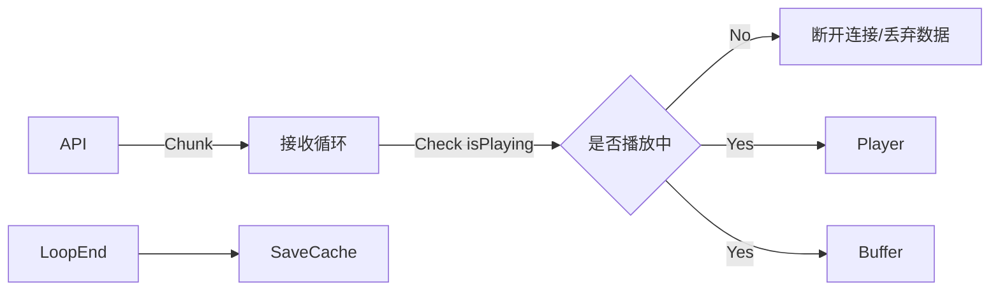
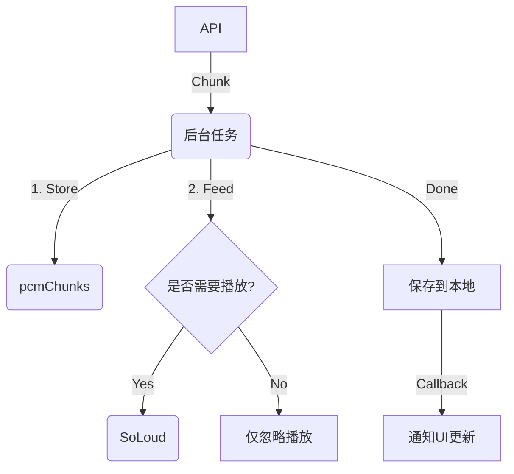
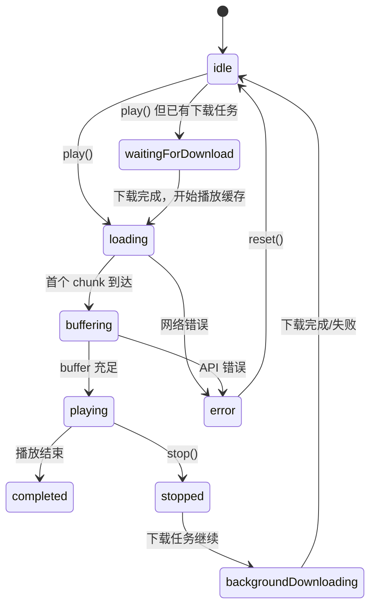

# TTS 流式播放优化方案：下载与播放解耦

## 1. 背景与问题

### 当前现状

目前的 TTS (Text-to-Speech) 播放逻辑中，**数据接收 (Download)** 与 **音频播放 (Playback)** 是强耦合的。
在 `StreamingTtsService.playStreaming` 方法中，当用户触发“停止”或“暂停”操作时，代码会立即中断 API 数据流的接收循环。

### 存在的问题

1.  **资源浪费**：如果用户播放了 2 秒钟可以暂停或停止，而 API 可能已经生成了后续的音频数据。立即断开连接意味着丢弃了已生成的数据。鉴于 TTS API（如 Google Gemini 或其他付费 API）费用昂贵，这是一笔不必要的开销。
2.  **缓存失效**：目前的缓存保存逻辑（`_saveToCacheFile`）仅在数据流完整接收（`TTSChunkType.done`）后触发。提前中断会导致本次请求无法生成缓存文件。
3.  **用户体验**：下次用户再次点击播放同一条消息时，必须重新发起网络请求，增加了延迟。

## 2. 核心设计理念

为了解决上述问题，我们需要将 **“音频数据获取”** 的生命周期与 **“音频播放”** 的生命周期 **解耦**。

- **播放任务 (Playback Task)**：由用户 UI 控制，随时可以 Start/Stop。
- **下载任务 (Download Task)**：一旦启动，应在后台持续运行直到完成或通过错误终止，**不应受用户停止播放的影响**。

## 3. 详细设计方案

### 3.1 架构调整

在 `StreamingTtsService` 中引入“后台下载任务管理”机制。

1.  **引入 `_activeDownloads` 注册表**：
    - `Map<String, Future<String?>> _activeDownloads`: 用于跟踪当前正在进行的下载任务（Key 为 `messageId` 或 `cacheKey`）。
    - 防止对同一条消息重复发起请求。

2.  **分离 `stop()` 逻辑**：
    - `stop()` 方法将只停止音频引擎（`SoLoud` 或 `AudioPlayer`）。
    - 它**不会**取消正在运行的 `await for` 循环（除非整个 Service 被销毁）。

### 3.2 数据流向变更

**原有流程 (耦合)**：



**新流程 (解耦)**：



### 3.3 关键逻辑详述

#### A. `playStreaming` 的新逻辑

1.  **检查缓存**：(现有逻辑) 如果本地文件存在，直接播放文件。
2.  **检查是否正在下载**：
    - 如果 `_activeDownloads` 中包含该 `messageId`，说明之前请求过但尚未完成。
    - **策略**：
      - 简单方案：等待下载完成（await future），然后播放文件（会有一段静默等待期）。
      - **优化方案（推荐）**：由于很难中途插入到别人的 stream 监听中，建议如果在下载中，先 UI 显示 Loading，等待该 Future 完成后直接播放生成的缓存文件。
3.  **发起新下载**：
    - 如果既无缓存也无下载任务，启动一个新的 `_downloadAndCache` 任务。
    - 同时，在任务内部，每收到一个 Chunk，检查 `currentPlayingMessageId == thisMessageId`。如果是，则实时喂给播放器。

#### B. `_downloadAndCache` (核心后台方法)

这是一个新的私有方法，负责“不顾一切”地把数据拿完。

```dart
Future<String?> _downloadAndCache(String text, String messageId) async {
  // 1. 初始化 Buffer
  List<Uint8List> buffer = [];

  // 2. 开始 API 请求
  await for (final chunk in apiService.generateTTSStream(...)) {
    // 3. 处理数据
    if (chunk.isAudio) {
       buffer.add(chunk.bytes);

       // 关键点：这里不再判断 if (!isPlaying) break;
       // 而是判断是否要“喂”给当前正在播放的会话
       if (_currentPlayingMessageId == messageId && !_isPlayerStopped) {
         _soloud.addAudioDataStream(source, chunk.bytes);
       }
    }
  }

  // 4. 保存文件
  final path = await _saveToDisk(buffer);

  // 5. 清理正在下载标记
  _activeDownloads.remove(messageId);
  return path;
}
```

#### C. `stop()` 的变更

- 设置 `_isPlayerStopped = true`。
- 调用 `_soloud.stop()`。
- 清空 `_currentPlayingMessageId`。
- **绝对不** 干涉任何正在运行的 `Future` 任务。

### 3.4 边界情况处理 (Edge Cases)

| 场景                                | 当前行为         | 预期优化行为                                                                             |
| :---------------------------------- | :--------------- | :--------------------------------------------------------------------------------------- |
| **Play A -> Stop (API 未完)**       | 断开 API，无缓存 | 停止声音，后台继续下载 A，完成后生成缓存。                                               |
| **Play A -> Stop -> Play A (立即)** | 重新请求 API     | 检测到 A 正在下载，显示 Loading 或尝试复用流（复杂度高），建议**等待下载完成自动播放**。 |
| **Play A -> Play B (立即)**         | A 断开，请求 B   | A 停止声音但后台继续下载；B 开始请求并播放。A 下载完后静默保存。                         |
| **Play A -> App Background**        | 甚至可能 Crash   | 保持下载直到 App 被系统杀掉。                                                            |
| **Network Error**                   | 抛出异常         | 下载任务失败，清理 `_activeDownloads`，通知 UI 错误。                                    |

## 4. 资源限制与配置

为避免内存溢出和资源滥用，定义以下常量：

```dart
class _TtsDownloadConfig {
  /// 最大并发下载任务数
  static const int maxConcurrentDownloads = 3;

  /// 单个下载任务超时时间
  static const Duration downloadTimeout = Duration(seconds: 60);

  /// 单个音频 Buffer 最大大小 (约 5 分钟 @24kHz 16-bit mono ≈ 14MB)
  static const int maxBufferSizeBytes = 15 * 1024 * 1024; // 15MB

  /// 下载任务队列清理间隔
  static const Duration cleanupInterval = Duration(minutes: 5);
}
```

### 4.1 内存估算

| 音频时长 | PCM 大小 (24kHz, 16-bit, mono) |
| -------- | ------------------------------ |
| 10 秒    | ~480 KB                        |
| 1 分钟   | ~2.9 MB                        |
| 5 分钟   | ~14.4 MB                       |

**结论**：对于典型的聊天消息（<30 秒），单个 Buffer 约 1.4MB，3 个并发下载最多占用 ~5MB 内存，完全可接受。

## 5. 错误处理策略

### 5.1 `_downloadAndCache` 完整实现

```dart
Future<String?> _downloadAndCache(String text, String messageId) async {
  final List<Uint8List> buffer = [];
  int totalBytes = 0;

  try {
    await for (final chunk in apiService.generateTTSStream(...))
        .timeout(_TtsDownloadConfig.downloadTimeout) {

      if (chunk.isAudio) {
        // 检查 Buffer 大小限制
        if (totalBytes + chunk.bytes.length > _TtsDownloadConfig.maxBufferSizeBytes) {
          throw TtsException('Audio too long, exceeds buffer limit');
        }

        buffer.add(chunk.bytes);
        totalBytes += chunk.bytes.length;

        // 喂给播放器（如果正在播放此消息）
        if (_currentPlayingMessageId == messageId && !_isPlayerStopped) {
          _soloud.addAudioDataStream(source, chunk.bytes);
        }
      }
    }

    // 保存完整文件
    final path = await _saveToDisk(buffer);
    return path;

  } on TimeoutException {
    // 超时：保存已下载的部分（如果足够长）
    if (buffer.isNotEmpty && totalBytes > 48000) { // 至少 1 秒
      return await _saveToDisk(buffer, partial: true);
    }
    return null;

  } on TtsApiException catch (e) {
    // API 错误（如配额耗尽）：通知 UI
    _notifyError(messageId, e.message);
    return null;

  } finally {
    // 无论成功失败，都要清理注册表
    _activeDownloads.remove(messageId);
  }
}
```

### 5.2 错误类型定义

```dart
/// TTS 服务相关异常
class TtsException implements Exception {
  final String message;
  TtsException(this.message);
}

/// API 层面的错误（如配额、认证）
class TtsApiException extends TtsException {
  final int? statusCode;
  TtsApiException(super.message, {this.statusCode});
}
```

## 6. 状态机设计

### 6.1 状态枚举更新

为支持新架构，需要扩展 `StreamingTtsState`：

```dart
enum StreamingTtsState {
  /// 初始状态
  idle,

  /// 正在加载/初始化
  loading,

  /// 正在缓冲音频数据
  buffering,

  /// 正在播放
  playing,

  /// 播放完成
  completed,

  /// 用户停止播放（但后台可能仍在下载）
  stopped,

  /// 🆕 后台下载中（用户已停止播放，但下载任务仍在进行）
  backgroundDownloading,

  /// 🆕 等待下载完成（用户请求播放正在下载中的消息）
  waitingForDownload,

  /// 发生错误
  error,
}
```

### 6.2 状态转换图



## 7. TtsPlaybackMixin 集成

### 7.1 Mixin 层需要的修改

`TtsPlaybackMixin` 需要处理新增的状态：

```dart
void _setupTtsStateListener(...) {
  streamingTts.onStateChanged = (state) {
    if (!isMounted()) return;

    switch (state) {
      case StreamingTtsState.loading:
      case StreamingTtsState.buffering:
      case StreamingTtsState.waitingForDownload: // 🆕
        onStateChange(true, false);
        break;

      case StreamingTtsState.playing:
        onStateChange(false, true);
        break;

      case StreamingTtsState.completed:
      case StreamingTtsState.stopped:
      case StreamingTtsState.backgroundDownloading: // 🆕 用户视角已停止
        onStateChange(false, false);
        break;

      case StreamingTtsState.error:
        onStateChange(false, false);
        break;

      case StreamingTtsState.idle:
        break;
    }
  };
}
```

### 7.2 UI 提示增强

当状态为 `waitingForDownload` 时，建议在 UI 显示友好提示：

```dart
// 在 ChatBubble 或 ShadowingSheet 中
if (state == StreamingTtsState.waitingForDownload) {
  showToast('正在缓存中，即将播放...');
}
```

## 8. CacheKey 策略

### 8.1 当前实现

目前使用 `messageId` 作为缓存 Key：

```dart
await streamingTts.playStreaming(text, messageId: cacheKey);
```

### 8.2 潜在问题

如果消息内容可编辑，同一 `messageId` 可能对应不同的 `text`，导致播放错误的缓存。

### 8.3 解决方案

**方案 A**（推荐，适用于 TriTalk）：

- TriTalk 中 AI 生成的消息不可编辑，因此 `messageId` 作为 Key 是安全的。
- 在文档中明确这一前提假设。

**方案 B**（通用方案）：

```dart
String generateCacheKey(String text, String messageId) {
  final textHash = sha256.convert(utf8.encode(text)).toString().substring(0, 8);
  return '${messageId}_$textHash';
}
```

**TriTalk 决策**：采用方案 A，保持 `messageId` 作为 Key，因为消息不可编辑。

## 9. 已知限制

| 限制             | 描述                                | 规避方案                                                                 |
| ---------------- | ----------------------------------- | ------------------------------------------------------------------------ |
| **iOS 后台执行** | iOS 后台任务默认只有 ~30 秒执行时间 | V1 不保证后台下载完成；未来可探索 `beginBackgroundTask` 或 `workmanager` |
| **断点续传**     | 网络中断后不支持从已下载位置继续    | V1 接受这一限制；完整数据才缓存                                          |
| **并发限制**     | 最多 3 个并发下载                   | 超出时，新任务需等待旧任务完成                                           |
| **大文件**       | 超过 5 分钟的音频会被截断           | TTS 场景下极少有如此长的消息                                             |

## 10. 实施步骤

1.  ✅ **修改 `StreamingTtsService` 状态管理**：
    - 添加 `Map<String, _DownloadTask> _activeDownloads`。
    - 添加 `String? _currentPlayingMessageId` 用于标识当前播放器正在为谁服务。
    - 添加 `bool _isPlayerStopped` 标记播放器是否被用户停止。
2.  ✅ **添加配置常量**：
    - 添加 `_TtsDownloadConfig` 类，包含超时、并发数、Buffer 限制。
3.  ✅ **重构 `playStreaming`**：
    - 拆分为"公共入口"和"后台下载 worker" (`_startStreamingDownload` + `_executeDownload`)。
    - 公共入口决定是 `await` 现有的下载任务，还是启动新的 worker。
4.  ✅ **实现 `_executeDownload`**（对应文档中的 `_downloadAndCache`）：
    - 包含完整的错误处理、超时处理、Buffer 限制。
    - 下载完成后无论是否正在播放，都保存缓存。
5.  ✅ **重写 `stop` 逻辑**：
    - 拆分为 `_stopPlaybackOnly()` 和 `stop()`。
    - 只控制播放器状态 (`_isPlayerStopped = true`)。
    - **不**取消任何正在进行的下载任务。
    - 新增 `cancelAll()` 方法用于强制取消所有任务。
6.  ✅ **更新状态枚举**：
    - 添加 `backgroundDownloading` 和 `waitingForDownload` 状态。
7.  ✅ **更新 `TtsPlaybackMixin`**：
    - 处理新增的状态枚举值。
8.  ⏳ **验证测试**：
    - 执行下方测试用例列表。

## 11. 测试用例

### 11.1 功能测试

| #   | 场景           | 操作                    | 预期结果                                           |
| --- | -------------- | ----------------------- | -------------------------------------------------- |
| T1  | 正常播放       | 点击 Play，等待完成     | 播放完成，缓存文件生成                             |
| T2  | 播放中停止     | Play → 2 秒后 Stop      | 停止声音，后台继续下载，最终生成缓存               |
| T3  | 停止后立即重播 | Play → Stop → 立即 Play | 显示 Loading，等待下载完成后自动播放缓存           |
| T4  | 快速切换       | Play A → 1 秒后 Play B  | A 停止声音但继续下载；B 开始播放；两者最终都有缓存 |
| T5  | 缓存命中       | 播放已缓存的消息        | 直接播放缓存文件，无 API 请求                      |
| T6  | 网络错误       | 断网后点击 Play         | 显示错误提示，`_activeDownloads` 被清理            |
| T7  | 超时           | 使用极慢网络            | 60 秒后超时，保存部分数据（如果>1秒）或丢弃        |
| T8  | 并发限制       | 快速点击 4 条不同消息   | 前 3 条开始下载，第 4 条等待                       |

### 11.2 边界测试

| #   | 场景                    | 预期结果                              |
| --- | ----------------------- | ------------------------------------- |
| E1  | 空文本                  | 抛出 `TtsException`                   |
| E2  | 超长文本（>5 分钟音频） | Buffer 达到限制后停止，保存已下载部分 |
| E3  | App 进入后台            | 下载继续（iOS 可能被系统终止）        |
| E4  | Service dispose         | 所有下载任务被取消并清理              |

---

## 12. 总结

此方案通过**解耦下载与播放的生命周期**，实现：

- ✅ **节省 API 成本**：停止播放不中断下载，避免重复请求
- ✅ **提升用户体验**：重复播放时直接使用缓存，零延迟
- ✅ **可控的资源消耗**：通过并发限制和 Buffer 上限，避免内存问题

**预估工作量**：2-3 个开发日

**风险**：

- 低风险：状态管理复杂度增加
- 可控：通过完善的测试用例覆盖边界情况
