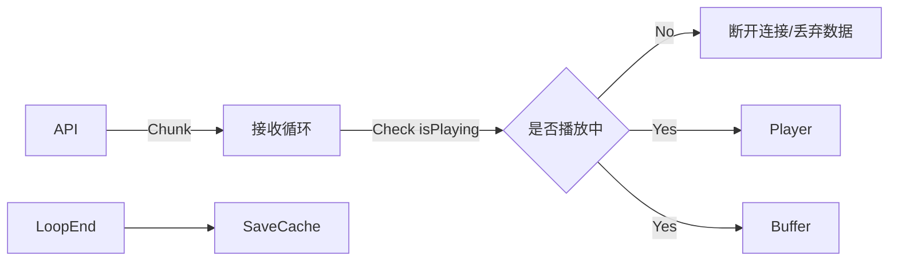
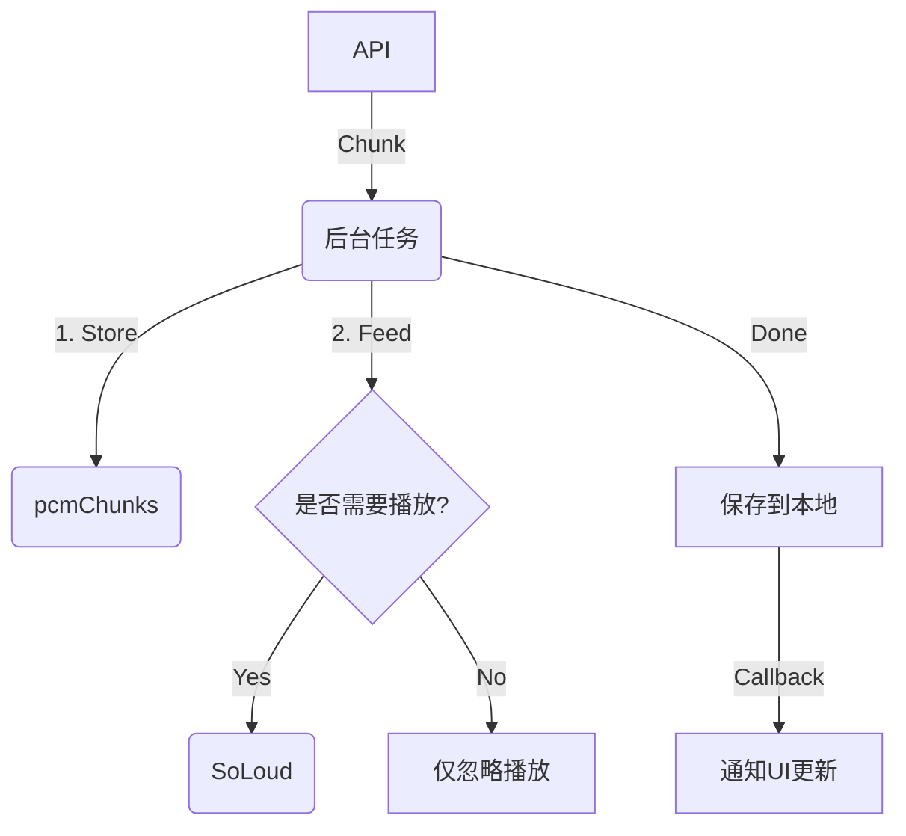

# TTS 流式播放优化方案：下载与播放解耦

## 1. 背景与问题

### 当前现状

目前的 TTS (Text-to-Speech) 播放逻辑中，**数据接收 (Download)** 与 **音频播放 (Playback)** 是强耦合的。
在 `StreamingTtsService.playStreaming` 方法中，当用户触发“停止”或“暂停”操作时，代码会立即中断 API 数据流的接收循环。

### 存在的问题

1.  **资源浪费**：如果用户播放了 2 秒钟可以暂停或停止，而 API 可能已经生成了后续的音频数据。立即断开连接意味着丢弃了已生成的数据。鉴于 TTS API（如 Google Gemini 或其他付费 API）费用昂贵，这是一笔不必要的开销。
2.  **缓存失效**：目前的缓存保存逻辑（`_saveToCacheFile`）仅在数据流完整接收（`TTSChunkType.done`）后触发。提前中断会导致本次请求无法生成缓存文件。
3.  **用户体验**：下次用户再次点击播放同一条消息时，必须重新发起网络请求，增加了延迟。

## 2. 核心设计理念

为了解决上述问题，我们需要将 **“音频数据获取”** 的生命周期与 **“音频播放”** 的生命周期 **解耦**。

- **播放任务 (Playback Task)**：由用户 UI 控制，随时可以 Start/Stop。
- **下载任务 (Download Task)**：一旦启动，应在后台持续运行直到完成或通过错误终止，**不应受用户停止播放的影响**。

## 3. 详细设计方案

### 3.1 架构调整

在 `StreamingTtsService` 中引入“后台下载任务管理”机制。

1.  **引入 `_activeDownloads` 注册表**：
    - `Map<String, Future<String?>> _activeDownloads`: 用于跟踪当前正在进行的下载任务（Key 为 `messageId` 或 `cacheKey`）。
    - 防止对同一条消息重复发起请求。

2.  **分离 `stop()` 逻辑**：
    - `stop()` 方法将只停止音频引擎（`SoLoud` 或 `AudioPlayer`）。
    - 它**不会**取消正在运行的 `await for` 循环（除非整个 Service 被销毁）。

### 3.2 数据流向变更

**原有流程 (耦合)**：



**新流程 (解耦)**：



### 3.3 关键逻辑详述

#### A. `playStreaming` 的新逻辑

1.  **检查缓存**：(现有逻辑) 如果本地文件存在，直接播放文件。
2.  **检查是否正在下载**：
    - 如果 `_activeDownloads` 中包含该 `messageId`，说明之前请求过但尚未完成。
    - **策略**：
      - 简单方案：等待下载完成（await future），然后播放文件（会有一段静默等待期）。
      - **优化方案（推荐）**：由于很难中途插入到别人的 stream 监听中，建议如果在下载中，先 UI 显示 Loading，等待该 Future 完成后直接播放生成的缓存文件。
3.  **发起新下载**：
    - 如果既无缓存也无下载任务，启动一个新的 `_downloadAndCache` 任务。
    - 同时，在任务内部，每收到一个 Chunk，检查 `currentPlayingMessageId == thisMessageId`。如果是，则实时喂给播放器。

#### B. `_downloadAndCache` (核心后台方法)

这是一个新的私有方法，负责“不顾一切”地把数据拿完。

```dart
Future<String?> _downloadAndCache(String text, String messageId) async {
  // 1. 初始化 Buffer
  List<Uint8List> buffer = [];

  // 2. 开始 API 请求
  await for (final chunk in apiService.generateTTSStream(...)) {
    // 3. 处理数据
    if (chunk.isAudio) {
       buffer.add(chunk.bytes);

       // 关键点：这里不再判断 if (!isPlaying) break;
       // 而是判断是否要“喂”给当前正在播放的会话
       if (_currentPlayingMessageId == messageId && !_isPlayerStopped) {
         _soloud.addAudioDataStream(source, chunk.bytes);
       }
    }
  }

  // 4. 保存文件
  final path = await _saveToDisk(buffer);

  // 5. 清理正在下载标记
  _activeDownloads.remove(messageId);
  return path;
}
```

#### C. `stop()` 的变更

- 设置 `_isPlayerStopped = true`。
- 调用 `_soloud.stop()`。
- 清空 `_currentPlayingMessageId`。
- **绝对不** 干涉任何正在运行的 `Future` 任务。

### 3.4 边界情况处理 (Edge Cases)

| 场景                                | 当前行为         | 预期优化行为                                                                             |
| :---------------------------------- | :--------------- | :--------------------------------------------------------------------------------------- |
| **Play A -> Stop (API 未完)**       | 断开 API，无缓存 | 停止声音，后台继续下载 A，完成后生成缓存。                                               |
| **Play A -> Stop -> Play A (立即)** | 重新请求 API     | 检测到 A 正在下载，显示 Loading 或尝试复用流（复杂度高），建议**等待下载完成自动播放**。 |
| **Play A -> Play B (立即)**         | A 断开，请求 B   | A 停止声音但后台继续下载；B 开始请求并播放。A 下载完后静默保存。                         |
| **Play A -> App Background**        | 甚至可能 Crash   | 保持下载直到 App 被系统杀掉。                                                            |
| **Network Error**                   | 抛出异常         | 下载任务失败，清理 `_activeDownloads`，通知 UI 错误。                                    |

## 4. 实施步骤

1.  **修改 `StreamingTtsService` 状态管理**：
    - 添加 `Map<String, Future<String?>> _activeDownloads`。
    - 添加 `String? _currentStreamingId` 用于标识当前播放器正在为谁服务。
2.  **重构 `playStreaming`**：
    - 拆分为“公共入口”和“后台下载 worker”。
    - 公共入口决定是 `await` 现有的下载任务，还是启动新的 worker。
3.  **重写 `stop` 逻辑**：
    - 只控制播放器状态，不控制下载流。
4.  **验证**：
    - 测试播放中断后，检查文件系统是否最终生成了 wav 文件。
    - 测试快速切换 A/B 消息时的稳定性。

---

**总结**：此方案将通过少量内存换取 API 调用的节省，并显著提升重复播放的体验。
