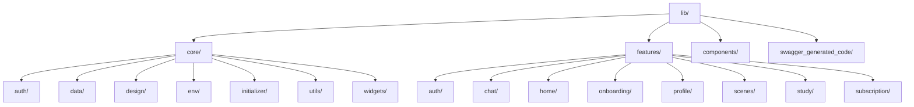

**English** | [中文](Architecture.md)

# TriTalk Frontend Architecture

This document describes the current architecture of the TriTalk frontend application.

## 🏗 High-Level Overview

TriTalk adopts a **Feature-First, Layered Architecture** powered by **Riverpod** for state management and dependency injection.

- **Feature-First**: The codebase is organized by business domains (features) rather than technical layers. Each feature is a self-contained module.
- **Layered**: Within each feature, code is separated into **Domain**, **Data**, and **Presentation** layers to enforce proper separation of concerns.
- **Reactive**: The UI is reactive, listening to immutable state changes driven by Riverpod Notifiers.

### Tech Stack

- **Framework**: Flutter
- **State Management & DI**: `flutter_riverpod`
- **Immutability**: `freezed`
- **Data Serialization**: `json_serializable`
- **API Client**: `chopper` (generated via `swagger_dart_code_generator`)
- **Backend**: Supabase (PostgreSQL + Auth + Storage)

---

## 📂 Directory Structure

The `lib/` directory is organized as follows:



### 1. Core (`lib/core/`)

Contains code shared across multiple features or application-wide infrastructure.

- **`auth/`**: Global authentication state and logic (e.g., `AuthProvider`).
- **`data/`**: Global data services and clients.
  - `api/`: HTTP clients, Interceptors, base API services.
  - `local/`: Shared preferences, secure storage, database keys.
- **`design/`**: App theme, colors, typography, and assets.
- **`env/`**: Environment configuration (e.g., Dev vs. Prod).
- **`initializer/`**: App startup logic (Supabase init, specific service warm-ups).
- **`utils/`**: Helper functions and extensions.
- **`widgets/`**: Reusable infrastructure UI components (e.g., Loaders, Toasts, generic Buttons).

### 2. Features (`lib/features/`)

Each folder represents a specific business capability. A fully-featured module follows this internal structure:

```text
features/chat/
├── data/                 # Data Layer (Implementation)
│   ├── *_service.dart    # Data sources (API clients, local DAOs)
│   └── repositories/     # Implementation of Domain Repositories
├── domain/               # Domain Layer (Definitions)
│   ├── models/           # Dart Data Classes (Freezed)
│   └── repositories/     # Abstract Repository Interfaces
├── presentation/         # Presentation Layer (UI & Logic)
│   ├── notifiers/        # StateNotifiers / Notifiers (Business Logic)
│   ├── pages/            # Full Screen Widgets (Scaffolds)
│   ├── state/            # UI State Classes (Freezed)
│   └── widgets/          # Feature-specific UI components
└── providers/            # Riverpod Providers for the feature
```

> **Note**: Simpler features (e.g., `home/`, `onboarding/`) may omit `domain/` or `data/` layers if they don't define custom models or repository interfaces.

### 3. Components (`lib/components/`)

Contains standalone configuration components (e.g., `supabase_config.dart`).

### 4. Generated Code (`lib/swagger_generated_code/`)

Auto-generated API client code from Swagger/OpenAPI specs using `swagger_dart_code_generator`. **Do not edit manually** — regenerate using `flutter pub run build_runner build`.

---

## 🧱 Layer Details

### 1. Domain Layer (`domain/`)

_The stable heart of the feature._

> **Why "Domain"?** This term comes from [Domain-Driven Design (DDD)](https://en.wikipedia.org/wiki/Domain-driven_design), a software design approach that focuses on modeling software to match the business domain. The "domain" represents the core business logic and rules — independent of UI frameworks or data storage mechanisms.

- **Responsibility**: Defines "What" the feature does and "What" data it uses.
- **Contents**:
  - **Models**: Immutable data structures (e.g., `ChatMessage`, `Scene`).
  - **Repositories (Interfaces)**: Contracts defining data operations (e.g., `IChatRepository`).
- **Rules**: Pure Dart code. NO Flutter UI imports. NO data implementation details (Http, SharedPreferences).

### 2. Data Layer (`data/`)

_The implementation details._

- **Responsibility**: Implements repository interfaces to fetch/store data.
- **Contents**:
  - **Repository Implementations**: Implement `IChatRepository`. They orchestrate data fetching from remote sources (API) and local sources (Cache).
  - **Data Sources**: Direct connectors to external systems (e.g., `ChatApiService`, `ChatLocalService`).
- **Rules**: Depends on Domain.

### 3. Presentation Layer (`presentation/`)

_The user interface and interaction logic._

- **Responsibility**: Displays state and handles user input.
- **Contents**:
  - **Pages**: Top-level screens.
  - **Widgets**: reusable UI bits.
  - **Notifiers (View Models)**: Classes extending `Notifier` or `StateNotifier`. They hold the [Business Logic].
  - **State**: Immutable classes representing the UI state at any moment (e.g., `ChatPageState`).
- **Rules**: Depends on Domain. NEVER communicates directly with Data layer (uses Repositories via DI).

---

## 🔄 State Management Pattern

We use **Riverpod** to bind these layers together.

1.  **State Definition**: Defined using `Freezed`.

    ```dart
    @freezed
    class ChatPageState with _$ChatPageState {
      const factory ChatPageState({
        @Default([]) List<ChatMessage> messages,
        @Default(false) bool isLoading,
      }) = _ChatPageState;
    }
    ```

2.  **Notifier**: Manages the state and handles logic.

    ```dart
    class ChatPageNotifier extends StateNotifier<ChatPageState> {
      final IChatRepository _repository;

      // Dependency Injection via Constructor
      ChatPageNotifier(this._repository) : super(const ChatPageState());

      Future<void> sendMessage(String text) async {
        state = state.copyWith(isLoading: true);
        await _repository.sendMessage(text);
        state = state.copyWith(isLoading: false);
      }
    }
    ```

3.  **UI Consumption**:

    ```dart
    class ChatScreen extends ConsumerWidget {
      @override
      Widget build(BuildContext context, WidgetRef ref) {
        // Watch the state
        final state = ref.watch(chatPageProvider);

        // Trigger logic
        return FloatingActionButton(
          onPressed: () => ref.read(chatPageProvider.notifier).sendMessage("Hello"),
          child: state.isLoading ? CircularProgressIndicator() : Icon(Icons.send),
        );
      }
    }
    ```
