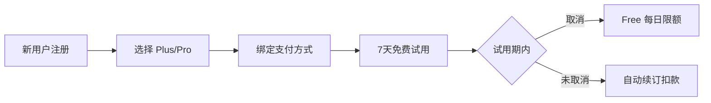

# TriTalk 定价策略方案

> **版本**: 1.2  
> **日期**: 2026-01-19  
> **状态**: 方案设计（未实现）  
> **货币**: USD (美元)  
> **参考**: [成本分析文档](file:///Users/tristatang/Desktop/TriTalk/docs/cost_analysis.md)

---

## 1. 成本分析

> [!IMPORTANT]
> 以下数据基于 [cost_analysis.md](file:///Users/tristatang/Desktop/TriTalk/docs/cost_analysis.md) 的实际测算。

### 1.1 综合成本汇总

| DAU 规模 | Cloudflare | Supabase | GCP TTS | Azure Speech | **月总成本** | **人均成本/月** |
|----------|------------|----------|---------|--------------|--------------|-----------------|
| 开发阶段 | $0 | $0 | $0 (Free) | $0 | **$0** | - |
| 100 DAU | $0 | $0 | $0 (Free) | ~$165 | **~$165** | **~$1.65** |
| 1000 DAU | $5 | $0-25 | $750-1,500* | $1,650 | **$2,400-3,200** | **$2.4-3.2** |
| 10K DAU | $11 | $25 | $7,500-15,000* | $16,500 | **$24,000-31,500** | **$2.4-3.15** |

> \* TTS 成本假设 50% 缓存命中率；通过优化可进一步降低。

### 1.2 核心 API 单次成本

| 服务 | 提供商 | 单次成本 |
|------|--------|----------|
| TTS 语音合成 (10词句子) | GCP Gemini | **$0.001** |
| 发音评估 (10词句子) | Azure Speech | **$0.001** |
| 单词发音 | GCP Gemini | **$0.00025** |

### 1.3 用户日均成本 (深度练习)

| 活动 | 日成本 | 月成本 |
|------|--------|--------|
| TTS 句子朗读 (50句) | $0.05 | $1.5 |
| 发音评估 (50句) | $0.055 | $1.65 |
| 单词发音 (100词) | $0.025 | $0.75 |
| **总计** | **~$0.13** | **~$3.9** |

### 1.4 各档位用户日均成本估算

| 档位 | 每日使用量 | 日成本 | 月成本 | 定价 | 毛利率 |
|------|-----------|--------|--------|------|--------|
| **Free** | 3次对话 | ~$0.005 | ~$0.15 | $0 | - |
| **Plus** | 20次对话 | ~$0.044 | ~$1.32 | $9.99 | **87%** ✅ |
| **Pro** | 100次对话 | ~$0.22 | ~$6.60 | $24.99 | **73%** ✅ |

> [!TIP]
> Pro 用户拥有 **100次/天** 的超高额度：
> - 实际上等同于**无限制**（很难有人每天聊满 3-4 小时）
> - 即使按满额计算，毛利率仍保持在健康的 **70%+**

---

## 2. 订阅方案

### 2.1 用户旅程



### 2.2 三档定价

> [!TIP]
> **策略 B**: 7 天免费试用 + 每日限额，平衡体验与成本。

| 计费方式 | 🆓 Free | ⭐ Plus | 💎 Pro |
| :--- | :--- | :--- | :--- |
| **按月订阅** | 免费 | **$9.99 /月**<br><span style="color:grey;font-size:0.9em">(原价 $119.88/年)</span> | **$24.99 /月**<br><span style="color:grey;font-size:0.9em">(原价 $299.88/年)</span> |
| **按年订阅**<br><span style="color:#d93025;font-size:0.9em">🔥 限时 6 折</span> | - | **$71.99 /年**<br><span style="color:#188038;font-size:0.9em">(立省 40%)</span> | **$179.99 /年**<br><span style="color:#188038;font-size:0.9em">(立省 40%)</span> |
| **每日限额** | 3次对话/天 | 20次对话/天 | 100次对话/天 |

### 2.3 7 天免费试用（平台标准订阅模式）

> [!NOTE]
> 采用 **App Store / Google Play 标准订阅模式**，与主流应用一致。

| 项目 | 内容 |
|------|------|
| **试用内容** | 完整 Plus 功能 |
| **试用时长** | 7 天 |
| **需绑定支付** | ✅ 平台要求 |
| **试用结束** | **自动续订扣款**（用户可提前取消） |
| **首月扣款** | Plus $2.99 / Pro $9.99（首月优惠） |
| **试用成本** | ~$0.50/用户 |
| **预期转化率** | 10-15%（高于手动订阅） |

**用户流程**:
```
注册 → 选择 Plus/Pro → 绑定支付 → 7天免费试用 → 自动续订
                                              ↓
                              （用户可在试用期内随时取消）
```

### 2.4 功能对比矩阵 (MVP 版本)

> [!NOTE]
> **设计理念**: 量大管饱，消除用量焦虑。
> - **Free**: ~5 分钟 (体验核心功能)
> - **Plus**: ~50 分钟 (超值日常练习)
> - **Pro**: ~4 小时 (沉浸式母语环境)

| 功能模块 | 功能 | 🔥 试用期 | 🆓 Free | ⭐ Plus | 💎 Pro |
|----------|------|-----------|---------|---------|--------|
| **对话练习** | AI 对话次数 | 20次/天 | 3次/天 | 20次/天 | 100次/天 |
| | 语音输入 | 20次/天 | 3次/天 | 20次/天 | 100次/天 |
| **跟读练习** | 发音评估次数 | 20次/天 | 3次/天 | 20次/天 | 100次/天 |
| | 单词发音 | ✅ 无限制 | 10次/天 | ✅ 无限制 | ✅ 无限制 |
| | 音高对比分析 | ✅ | ❌ | ✅ | ✅ |
| **语法分析** | 深度分析次数 | 20次/天 | 3次/天 | 20次/天 | 100次/天 |
| **场景功能** | 预置场景 | 全部(12个) | 5个 | 全部(12个) | 全部(12个) |
| | 自定义场景（含 AI 生成） | 10个 | ❌ | 10个 | 50个 |
| **TTS 语音** | AI 消息朗读 | 20次/天 | 3次/天 | 20次/天 | 100次/天 |
| **数据同步** | 多设备同步 | ✅ | ❌ | ✅ | ✅ |

**💡 使用时长估算**:
- Free (3次对话): 约 **5-8 分钟**/天
- Plus (20次对话): 约 **45-60 分钟**/天
- Pro (100次对话): 约 **3-4 小时**/天

**📍 预置场景列表**:

| Free (5个) | Plus/Pro 解锁 (7个) |
|------------|---------------------|
| ☕ 咖啡店点单 | ✈️ 机场值机 |
| 🚕 打车出行 | 🏨 酒店入住 |
| 🛒 超市购物 | 🗺️ 问路导航 |
| 🍽️ 餐厅点餐 | 💼 工作面试 |
| 👋 自我介绍 | 🤝 商务会议 |
| | 🎬 电影讨论 |
| | 🩺 看医生 |

**📌 第二版计划功能**（暂不差异化）:
- 对话历史保存限制
- 练习历史记录限制
- 词汇详解分级
- 收藏词汇导出

---

## 3. 定价策略

### 3.1 价格定位

| 方案 | 目标用户 | 核心卖点 | 成本覆盖 |
|------|----------|----------|----------|
| **Free** | 体验用户 | 低门槛尝试（~5分钟/天） | 限额控制在 $0.15/月 |
| **Plus** | 日常练习 | 物超所值（~1小时/天） | $9.99 > $1.32成本 ✅ |
| **Pro** | 重度用户 | 几乎无限（~4小时/天） | $24.99 > $6.6成本 ✅ |

### 3.2 价格锚点

- **Plus $9.99/月**: 约等于两杯星巴克，日均 $0.33
- **Pro $24.99/月**: 低于一节外教课 ($30+)，性价比突出
- **年付优惠**: 享约 40% 折扣，提高用户 LTV

---

## 4. 转化策略

### 4.1 Free → Plus 触发点

| 触发场景 | 提示文案 |
|----------|----------|
| 对话次数用尽 | "Upgrade to Plus for 20 daily lessons (almost 1 hour of practice)" |
| 跟读评估用尽 | "Want more practice? Plus gives you 20 assessments/day" |
| 尝试音高对比 | "Pitch contour analysis is a Plus feature" |
| Pro 用户接近限额 | "Incredible dedication! You've reached the 100 daily limit." |

### 4.2 订阅激励

| 策略 | 时机/条件 | 描述 |
|------|----------|------|
| **首月优惠** | Day 6-7 | Plus **$2.99** / Pro **$9.99**（试用即将结束，限时优惠） |
| | Day 8-14 | Plus $4.99 / Pro $14.99（错过限时后仍有折扣） |
| | Day 15+ | 原价（无优惠） |
| **邀请返利** | 邀请好友注册 | 双方各得 7 天会员 |
| **学习成就** | 连续 7 天练习 | 解锁 10% 折扣 |
| **年付优惠** | 选择年付 | 享 40% 折扣，锁定长期用户 |

> [!TIP]
> **首月优惠的价值**:
> - 转化率可提升 **50-100%**
> - 首月付费用户续费率**远高于**未付费用户
> - 成本约 $4-5/转化用户，可接受

---

## 5. A/B 测试建议

> [!WARNING]
> **不建议直接进行价格 A/B 测试**。不同用户看到不同价格容易引发投诉和信任危机。

### 5.1 推荐测试方式

| 测试类型 | 描述 | 风险 |
|----------|------|------|
| ✅ **限额测试** | 调整 Free 用户每日限额 | 低风险 |
| ✅ **功能测试** | 调整各档位功能差异 | 低风险 |
| ✅ **促销测试** | 不同首月优惠幅度 | 低风险 |
| ⚠️ **区域定价** | 不同国家/地区定价 | 需谨慎 |
| ❌ **价格 A/B** | 同区域不同用户不同价 | 高风险 |

### 5.2 限额测试

| 测试组 | Free 对话限额 | 测试目标 |
|--------|---------------|----------|
| A | 10次/天 | 基准 |
| B | 5次/天 | 更激进转化 |
| C | 15次/天 | 更长体验期 |

### 5.3 促销测试

| 测试组 | 首月优惠 | 测试目标 |
|--------|----------|----------|
| A | Plus $2.99 / Pro $9.99 | 基准转化 |
| B | Plus $1.99 / Pro $6.99 | 低价引流 |
| C | 7天免费试用 | 体验优先 |

---

## 6. 收入预估模型

### 6.1 关键假设

| 参数 | 假设值 | 说明 |
|------|--------|------|
| MAU (月活) | 500-10,000 | 初创公司成长阶段 |
| DAU/MAU 比例 | 33% | 日活约为月活的 1/3 |
| Free → Plus 转化率 | 5% | 行业平均 3-8% |
| Plus → Pro 转化率 | 15% | 高价值用户比例 |
| Plus 单价 | $9.99/月 | 对标 HelloTalk VIP |
| Pro 单价 | $24.99/月 | 对标 ELSA Premium |

### 6.2 不同规模收入预估

> [!NOTE]
> **早期阶段分析**: $68/月净利看似很少，但这说明**单位经济模型从第一天就是健康的**。
> - ✅ 毛利率 34% 与 SaaS 行业标准一致
> - ✅ GCP $25K 赠金可覆盖早期 TTS 成本，实际净利更高
> - ⚠️ 早期应关注**转化率**而非绝对利润

#### 🌱 早期阶段 (MAU 500)

| 方案 | 用户数 | 单价 | 月成本 | 月收入 | 净利 |
|------|--------|------|--------|--------|------|
| Free | 475 (95%) | $0 | $71 | $0 | -$71 |
| Plus | 21 (4.25%) | $9.99 | $63 | $210 | +$147 |
| Pro | 4 (0.75%) | $24.99 | $32 | $100 | +$68 |
| 固定 | - | - | $3 | - | -$3 |
| **合计** | 500 | - | **$169** | **$310** | **+$141** |

毛利率: **45%** ✅

#### 🌿 成长阶段 (MAU 1,000)

| 方案 | 用户数 | 单价 | 月成本 | 月收入 | 净利 |
|------|--------|------|--------|--------|------|
| Free | 950 (95%) | $0 | $143 | $0 | -$143 |
| Plus | 43 (4.25%) | $9.99 | $129 | $430 | +$301 |
| Pro | 7 (0.75%) | $24.99 | $56 | $175 | +$119 |
| 固定 | - | - | $3 | - | -$3 |
| **合计** | 1,000 | - | **$331** | **$605** | **+$274** |

毛利率: **45%** ✅

#### 🌳 发展阶段 (MAU 3,000)

| 方案 | 用户数 | 单价 | 月成本 | 月收入 | 净利 |
|------|--------|------|--------|--------|------|
| Free | 2,850 (95%) | $0 | $428 | $0 | -$428 |
| Plus | 128 (4.25%) | $9.99 | $384 | $1,279 | +$895 |
| Pro | 22 (0.75%) | $24.99 | $176 | $550 | +$374 |
| 固定 | - | - | $9 | - | -$9 |
| **合计** | 3,000 | - | **$997** | **$1,829** | **+$832** |

毛利率: **45%** ✅

#### 🚀 规模阶段 (MAU 10,000)

| 方案 | 用户数 | 单价 | 月成本 | 月收入 | 净利 |
|------|--------|------|--------|--------|------|
| Free | 9,500 (95%) | $0 | $1,425 | $0 | -$1,425 |
| Plus | 425 (4.25%) | $9.99 | $1,275 | $4,246 | +$2,971 |
| Pro | 75 (0.75%) | $24.99 | $600 | $1,874 | +$1,274 |
| 固定 | - | - | $30 | - | -$30 |
| **合计** | 10,000 | - | **$3,330** | **$6,120** | **+$2,790** |

毛利率: **45%** ✅

### 6.3 成长路径汇总

| 阶段 | MAU | 时间周期 | 月收入 | 月成本 | 月净利 | 年化收入 |
|------|-----|----------|--------|--------|--------|----------|
| 🌱 早期 | 500 | 3-6 月 | $310 | $169 | +$141 | ~$3,720 |
| 🌿 成长 | 1,000 | 6-12 月 | $605 | $331 | +$274 | ~$7,260 |
| 🌳 发展 | 3,000 | 12-18 月 | $1,829 | $997 | +$832 | ~$21,948 |
| 🚀 规模 | 10,000 | 18-24 月 | $6,120 | $3,330 | +$2,790 | ~$73,440 |

### 6.4 各阶段目标与关键指标

| 阶段 | 主要目标 | 关键指标 |
|------|----------|----------|
| 🌱 早期 | 产品验证、种子用户 | 留存率 > 30%，NPS > 30 |
| 🌿 成长 | PMF 验证、付费转化 | 转化率 > 3%，MRR 稳定增长 |
| 🌳 发展 | 规模化获客、优化转化 | CAC < LTV/3，转化率 > 5% |
| 🚀 规模 | 市场扩展、盈利优化 | 毛利率 > 40%，月增长 > 10% |

### 6.5 转化率敏感性分析 (MAU 3,000)

| 场景 | 转化率 | 月收入 | 月净利 |
|------|--------|--------|--------|
| 悲观 | 3% | $1,098 | +$101 |
| 基准 | 5% | $1,829 | +$832 |
| 乐观 | 8% | $2,926 | +$1,929 |

---

## 7. 竞品参考

| 产品 | 订阅档位 | 价格 (USD) | 核心功能定位 |
|------|----------|------------|--------------|
| **Duolingo** | Super (Plus) | $12.99/月 | 去广告、无限红心、离线学习 |
| | Family Plan | ~$9.99/人/年 | 家庭/团队共享 |
| **HelloTalk** | VIP | $6.99/月 | 无限翻译、语音转文字 |
| | Lifetime | ~$149.99 (终身) | 一次性买断 |
| **ELSA Speak** | Pro | $7.99/月 | 发音评估、个性化学习 |
| | Premium | $13.33-$19.99/月 | AI 对话、语音分析器 |
| **TriTalk** | Plus | **$9.99/月** | AI 对话 (20次/天) + 发音评估 (20次/天) + 语法分析 |
| | Pro | **$24.99/月** | 几乎无限 (100次/天)，沉浸式学习 |

> **定位**: 
> - **Plus**: 与 ELSA Pro/HelloTalk VIP 同价位，但功能更全面，额度翻倍
> - **Pro**: 比 ELSA Premium 便宜 20-40%，提供海量额度（100次/天）
> - **差异化**: AI 对话 + 发音评估 + 语法分析三合一，无需多个 App
> - **透明定价**: 明确限额而非“无限”，避免滥用，保证服务质量

---

## 8. 实施优先级

| 阶段 | 任务 | 优先级 |
|------|------|--------|
| Phase 1 | 用量统计和限额系统 | P0 |
| Phase 1 | 接入支付 (Apple/Google IAP) | P0 |
| Phase 2 | 订阅状态管理 | P0 |
| Phase 2 | 付费引导 UI | P1 |
| Phase 3 | A/B 测试框架 | P2 |

---

## 9. 风险与应对

| 风险 | 应对策略 |
|------|----------|
| API 成本超预期 | 硬限额 + 动态调整 Free 额度 |
| 付费转化率低 | 优化 onboarding + 突出价值 |
| 用户流失率高 | 学习提醒 + 打卡奖励 |
| 竞品价格战 | 差异化功能 + 内容壁垒 |
